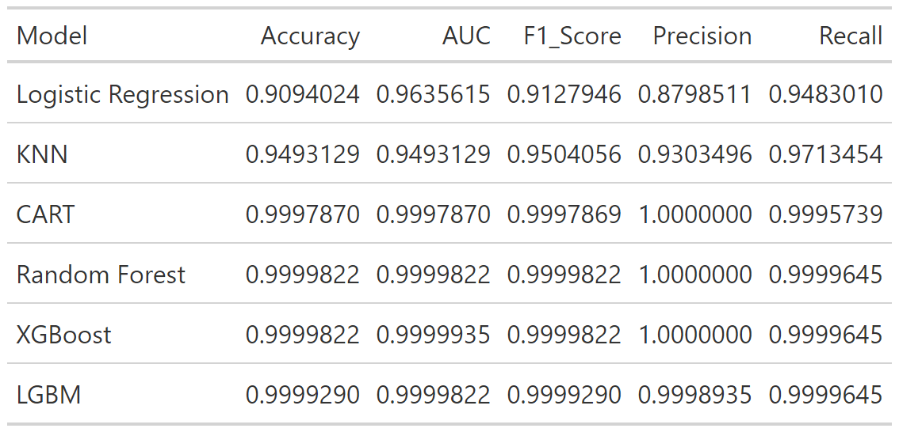

```{r setup, include=FALSE}

knitr::opts_chunk$set(
	echo = F, #it was TRUE by default
	message = FALSE,
	warning = FALSE,
	dev = "png" #this reduces a lot the size of the pdf output
)

knitr::opts_chunk$set(fig.pos = "H", out.extra = "")

#loading all required libraries
library(tidyverse)
library(modelsummary)
library(patchwork)
library(mgcv)
library(party)
library(ggfortify)
library(GGally)
library(knitr)
library(tidyr)
library(ggplot2)
library(dplyr)
library(corrplot)
library(kableExtra)
library(ggrepel)
library(wooldridge)
library(lattice)
library(Hmisc)
library(fixest)
library(randomForest)
library(randomForestExplainer)
library(here)
library(xgboost)
library(data.table)
library(caret)
```

\newpage

# Abstract

The research explores machine learning applications in financial contexts with the latest trends and challenges discussed. The paper goes beyond traditional descriptions given in current research on the subject, and puts these methods into practice to estimate the profitability of shares investments.

A comprehensive analysis is done using a dataset consisting of more than 400,000 random stock transactions that took place at NYSE over a period spanning ten years. By closely examining them in order to determine their accuracy rates among others like Recall or even ROC-AUC scores, it was found that just simple predictive models, say logistic regressions or decision trees, actually worked quite well.

More advanced methods of classification seemed to give better results. Among these are Tree Based algorithms (notably Gradient Boosting Algorithms), which always turn out far better predictions when compared to their competitors. This thesis provides an insightful document about the application of machine learning in finance and also indicates how advanced algorithms can contribute to better investment decisions.

\newpage

# Introduction to Artificial Intelligence and Machine Learning

Within the rapidly shifting landscape of technology, it is without a doubt that Artificial Intelligence (AI), Machine Learning (ML) as well as Deep Learning (DL) seem to be leading the pack since they come with highly transformative power and are very promising in terms of what can be achieved through them. Spanning through different sectors such as finance or health care among others; computer science has seen these three being integrated leading to change beyond our imagination for it promises to redefine our engagement and application of technology.

In the following comprehensive exploration, we aim to delve into the definitions, distinctions, and frontiers of AI, ML, and Deep Learning. By elucidating their fundamental concepts and highlighting the latest advancements, we aim to provide a deeper understanding of their role in shaping the future of computational intelligence. Moreover, we are going to elaborate on the formal definitions not only of Artificial Intelligence, but even of Machine Learning, and Deep Learning, emphasizing the features that prevent the three above from being regarded as a single concept.

## Artificial Intelligence

Providing a definition of Artificial Intelligent is not trivial at all. Numerous experts in various fields have tried to come up with a broad but comprehensive definition, but failing in their intent.

As pointed out by @kok2009artificial, one dictionary alone (namely *The New International Webster's Comprehensive Dictionary of the English Language*) provides four definitions of Artificial Intelligence. Among these definitions, AI is presented as an *area of study in the field of computer science,* [...] *concerned with the development of computers able to engage in human-like thought processes such as learning, reasoning, and self-correction*; or, similarly, as *the extension of human intelligence though the use of computers*. However, albeit accurate, these definitions still are incomplete.

As mentioned upon, defining Artificial Intelligence tackles a considerable challenge, encompassing a quite wide array of interpretations and applications. The integration of AI into our society really needs a comprehensive understanding of its essence, development trajectory, and current status. Various definitions abound in the discourse, and they all reflect the complexity and dynamism inherent in AI. At its core, AI can be undesrtood as an umbrella-term encompassing algorithms which are designed to simulate human intelligence. However, according to @sheikh2023artificial, equating AI solely with algorithms is a failure in the attempt to capture its essence, given the ubiquitous nature of algorithms in diverse fields predating AI. An overly restrictive definition, constricting AI to the imitation of human intelligence, discounts the progress achieved in current applications, portraying AI as an elusive future prospect rather than a present reality.

The last three authors discussed also give dissimilar views, the last one describing AI as the technology that makes machines behave just like human beings in terms of complicated things carried out by humans. However, they fail in making it explicit which specific capacities are involved; the result is that such definitions seem to be repeating themselves without aiding in any better understanding. Several expressions go deeper into the very operations involved in AI -- such as analysis of the surroundings, seeking of objectives, and acting on one's own accord. Nonetheless, these statements often sound vague as they are open to interpretation, and do not embrace all phenomena classified as AI. The problem of defining AI arises from its resemblance with human intelligence, which remains partly understood despite immense studies like those from psychology to neuroscience. Thus human intelligence and artificial intelligence are now seen to shape each other mutually. Examples from the past, like the rise of chess machines, show how our concept of what is intelligent has changed over time as well as the replication of such an artificial intelligence.

Moravec paradox shows that AI and human beings are not the same in many ways because there are tasks which are very simple to human that machines cannot execute and vice versa. This transformation from time to time in the perception of AI underscores the shifting borders of intelligence when computational capabilities are enhanced. Some have resorted to the introduction of new terms like prediction machines or oracles since these more accurately describe the nature of AI than anything else we might come up with. In spite of this conceptual challenge, it still seems as if AI remains so entrenched that people resist finding better terms for it. The rise of machine learning in the near future and recent strides in deep learning, whose progress we will detail later in this chapter, have focused attention on AI and prompted advances in areas such as facial recognition systems, game playing among others. The current trends in ML and DL reveal their modern application of pattern identification though not without constraints; this leads us to its different versions.

Due to its multifaceted character as well as a constantly changing landscape, there is need for open definitions that accommodate various technologies alongside future evolution of the same. In order to be specific yet flexible enough not lock out other possibilities at some point in future, AI HLEG proposes a definition that best describes AI systems which demonstrates intelligent behavior and functions autonomously when they want to achieve their goals. We must also understand that today's artificial intelligence applications fall under the heading of weak or narrow AI, focusing on specific problems rather than trying to replicate all human mental processes. Pedro Domingos rightly says that AI is all around us hence there is need for realistic goals concerning intelligence.

On the other hand, the complexity of defining Artificial Intelligence is analogous to the development of the field itself. To understand the current role of AI in contemporary society, it is important that we consider some aspects drawn from historical developments which will also help us appreciate how far this technology has come since its inception.

## Machine Learning

What talking about Artificial Intelligence, most of the times people refer to Machine Learning, since the two are usually regarded as the same concept. Actually, it turns out that Machine Learning is a subset of Artificial Intelligence that focuses on developing algorithms and models enabling computers to learn from data without need of explicit programming. In fact, Machine Learning algorithms autonomously learn patterns and relationships from large datasets, thereby improving their performance over time through experience.

Hence, the key distinction between AI and ML lies in their objectives. More specifically, Artificial Intelligence aims to replicate human intelligence when achieving various tasks; instead, Machine Learning is about algorithms' ability to learn from data, adjust themselves for errors and make predictions based on such learning process. In simpler terms, ML deals with the *learning aspect*, employing statistical techniques to enable computers to improve their performance on specific tasks through experience.

*Supervised* and *Unsupervised Machine Learning* serve as basic principles underlying AI with distinct ways of deriving insights from data. In Supervised Learning, the algorithms learn from labeled datasets where an input has its corresponding output label. Consequently, an algorithm that follows this approach manages to understand the relationship between input features and output labels, making it easier for us to work on tasks like classification and regression. Unlike this approach, Unsupervised Learning deals with untagged information in order to discover some concealed structures or patterns which are not obvious. This often involves grouping together similar data points or reducing dataset's dimensionality so as to expose underlying relationships.

These two paradigms serve as the foundations for machine learning applications, thereby leading to innovative measures taken towards predictive modelling as well as data analysis and pattern recognition in various fields. A closer examination into the methodologies and applications of supervised as well as unsupervised learning in artificial intelligence will provide for a better understanding of these concepts.

### Supervised Machine Learning

*Supervised Machine Learning* is a branch of artificial intelligence wherein algorithms are trained on labeled datasets. According to this model, every input has its own corresponding output tag. The core aim of supervised learning is that the algorithm should be able to learn relationships between features of input and those of output using labeled training data. It allows predictions or classifications in an unknown, fresh data by generalizing from known patterns within data through analysis of such patterns inside it. Supervised learning falls into two major categories: *classification* and *regression*. In classification problems, the output is made of discrete classes since it takes on the form of category labels. Using input data as well as patterns noted from labeled training information, such algorithms can make preassigned classes. Regression tasks are characterized by continuous output values which help in predicting numerical data from a set of features. Some of the algorithms utilized in supervised learning include k-NNs (k-Nearest Neighbor), decision trees and support vector machines used for classification tasks. In addition, they are used to model other spheres like business (marketing), image recognition, etc. Examples of *classification algorithms* include:

-   Logistic Regression

-   Support Vector Machines (SVM)

-   Decision Trees and Random Forests

-   k-Nearest Neighbors (k-NN)

-   Naive Bayes Classifier

-   Neural Networks (e.g., Multilayer Perceptrons)

### Unsupervised Machine Learning

On the other hand, *Unsupervised Machine Learning* constitutes a branch of artificial intelligence focused on analyzing unlabeled datasets. In comparison to supervised learning, unsupervised learning includes datasets that do not have pre-determined output labels or target variables. The main aim of unsupervised learning is for the algorithm to detect hidden patterns, structures or relationships among data points without supervision. One of them is clustering, which leads toward dimensionality reduction technique employed within this context to compress it. Clustering algorithms work by grouping together similar objects based on how close they are while in feature space, making an algorithm split its input data into some distinct groups or parts. They include k-means, hierarchical clustering (HC), density-based spatial clustering applications with noise (DBSCAN) among others. When it comes to dimensionality reduction techniques, they aim at diminishing input feature size through retaining critical pieces of information intrinsic within dataset. Such methods are useful for visualizing high-dimensional data, eliminating noise from it and enhancing future prediction models efficiency within different areas. Examples of dimensionality reduction techniques are principal component analysis (PCA), t-distributed stochastic neighbor embedding (t-SNE), linear discriminant analysis (LDA), autoencoders.

Unsupervised learning tasks can be broadly categorized into two main types: *Clustering* and *Dimensionality Reduction*.

**Clustering algorithms** group similar data points together based on their inherent similarities or distances in the feature space. The algorithm partitions the data into clusters, with data points within the same cluster being more similar to each other than to those in other clusters. Examples of clustering algorithms include:

-   K-Means Clustering

-   Hierarchical Clustering (Agglomerative and Divisive)

-   DBSCAN (Density-Based Spatial Clustering of Applications with Noise)

-   Gaussian Mixture Models (GMM)

-   Self-Organizing Maps (SOM)

**Dimensionality reduction** techniques aim to reduce the number of input features while preserving the essential information present in the data. This helps in visualizing high-dimensional data, removing noise, and improving the efficiency of subsequent machine learning algorithms. Examples of dimensionality reduction techniques include:

-   Principal Component Analysis (PCA)

-   t-Distributed Stochastic Neighbor Embedding (t-SNE)

-   Linear Discriminant Analysis (LDA)

-   Independent Component Analysis (ICA)

-   Autoencoders

These supervised and unsupervised learning algorithms form the backbone of machine learning applications, enabling computers to learn from data and extract valuable insights for decision-making, pattern recognition, and predictive modeling in various domains.

## Deep Learning

When it comes to machine learning (ML), almost everyone uses what is known as deep-learning since they think they both represent the same thing, as if artificial inteligence and deep learning are under the same umbrella. This is wrong. What actually happens is that deep-learning belongs to a sub-category known as ML, and it involves utilizing multi-layered neural nets referred to as deep neural networks whose performance emulates the intricate thought processes that humans exhibit. Majority of the artificial intelligence (AI) applications we interact with in our day to day lives today are driven by this approach. A deep neural network (DNN) is one that has three layers or more than three although many implementations have more than three layers. In order to do pattern recognition, identify relationships and understand certain occurrences, these networks undergo extensive training on large datasets which enable them to predict things more accurately than humans do. Unlike traditional machine learning techniques where one has to preprocess the data before applying an algorithm, deep-learning has made it easier for algorithms to consume raw unstructured data such as texts and images because it automates feature extraction and also reduces reliance on experts during the process. Through methods like backward pass or gradient descent using backpropagation, our solutions keep adjusting ourselves till we approach perfection i.e., until either all mislabeled instances become correct ones. Otherwise at this moment let us say that these instances are too far apart from being right predictions compared to their true labels from which extent they have moved away due noise present there etc.; henceforth we are working on moving closer towards global minimum/optimum solution when working within some search space set by its constraints. As an example, humans brains have inspired other artificial neural networks models since their basic operating principles mimic biological systems. Forward movement occurs whenever signals pass from one layer of units to another within the hidden layer whose output becomes input at subsequent layers beginning at input levels, and forward ends at an output node where prediction may be done during backpropagation; it consists mainly in error estimation that adjusts weights & biases in whole network structure to learn something new during training process. At the bottom, one arrives at various network types such as convolutional neural networks (CNN) or recurrent ones (RNN), developed for specific tasks like object recognition. Convolutional neural network (CNN) and recurrent neural network (RNN) are types of deep neural networks employed in solving computer vision problems among others. Deep-learning applications cut across sectors like law enforcement, financial services, customer service industry, health care sector etc., whereby they increase automation levels; improve analytical abilities while boosting effectiveness through different industries thus reshaping our daily technology interactions

\newpage

# Financial Applications of Artificial Intelligence and Machine Learning

As reported by @nazareth2023financial, the banking and financial sectors derive substantial benefits from AI. As a result, AI makes it possible for banks to identify fraud in transactions and enables managers to evaluate the credit rating, ranking, and providing of loans. The assistance of chats to customers through robo-advisers is carried out while at the same time asset allocation platforms provide risk-return evaluations for investors; automated insurance services are offered by machines that also cater to policyholders among other applications found in finance industry. Machine learning has become an indispensable tool in data analysis due to its ability to process large datasets plus its effectiveness in handling non-linearities within data sets. Recent years have seen a surge in research leveraging computational intelligence in financial contexts as discussed by @ozbayoglu2020deep . This paper consolidates and assesses emerging trends in numerical folkways in six fiscal areas: stock exchanges, holdings operation, forex markets, failure and indebtedness, monetary meltdown, and cryptocurrency. It considers several frameworks such as k-Nearest Neighbors, Bayesian Classifier, Decision Trees, Random Forest, Support Vector Machine, alongside Deep Learning Models like Artificial Neural Network/Deep Neural Network, Feed-forward Neural Network, Backpropagation Neural Network, Multilayer Perceptron, Convolutional Neural Network, Recurrent Neural Network, Long Short-Term Memory, Gated Recurrent Units, Reinforcement Learning Models, hybrid as well as ensemble models. Additionally, it determines why these models are vital for definite uses in the banking sector so as to effectively respond to numerous fiscal challenges.

Below, we will discuss some of the numerous Machine Learning applications in finance.

## Machine Learning for Stock Market Prediction

As discussed by @nazareth2023financial, predicting the stock market is an engaging but tough course of study because of the underlying properties of financial time series: erraticism, confusion, and lack of stability. The prevailing point of view of Efficient Market Hypothesis, claiming that it is near impossible to beat the market, notwithstanding advancements in technology have contributed in an increase in the precision of predictions made by analysts, hence making it possible for traders to achieve potential financial goals. The attention of investors and academics has been caught by the complexity of the stock market together with its numerous interconnected factors. A collection of factors such as political unrest, natural calamities, global interactions in foreign investments and changes in corporate management among others may lead to changes in the stock market behavior. Nevertheless, the mere identification of these elements and estimating how much they influence it is not enough: what matters is to include these aspects into predictive models by turning available data into meaningful features; this is an essential component of deep learning and machine learning models. In the field of financial time series forecasting, these variables play a vital part. The inherent noise and volatility found within stock market time series constitute very rigorous tests which determine whether machine learning techniques are strong or weak. In a thorough literature review, machine learning models have had the most significant impact on the stock market forecasting application, representing about 41% of all cited papers (N=126).

## Machine Learning for Fraud Detection

In the realm of financial security, machine learning has emerged as a powerful tool for *fraud detection*. By analyzing vast amounts of transactional data, machine learning algorithms can detect suspicious patterns and anomalies that may indicate fraudulent activity. This approach not only enables financial institutions to identify potential threats more efficiently but also allows for the adaptation and improvement of detection methods over time, ultimately enhancing overall security measures.

An interesting work on machine learning applications for fraud detection is the one linking to @awoyemi2017credit. The study indicates that more and more scams are on the rise in the finance industry, corporation, and government. Financial fraud, as cheating with the aim of gaining illegitimate money, is becoming common due to the wide use of internet based transactions like buying and selling products with credit cards. Owing to this fact that nowadays individuals are buying goods using internet based transactions, especially on credit cards, fraudulent use of credit cards appears to be on the rise through both inward and external dimensions; while it involves collusion between holders and banks using fake identities internally, it is a synonymous with exploiting robbed credit card details for unlawful acquisition of cash externally. Over the years, research has been carried out to help in determining external credit card thefts which are part of fake activities for majority cases. With the advent of computational approaches in particular big data times, these are no longer functional since they take more time before producing outcomes therefore there is need to switch such techniques as time goes on with technology changes for instance implementing computational approaches since traditional manual detection approaches are no longer applicable especially in such era which is characterized by big data.

*Data mining* is one of the distinguished methodologies utilized to detect fraudulent activities on credit cards. It involves categorizing transactions as valid or invalid depending on the study of how money is spent. This form of method has several methods that have been explored in Artificial Neural Networks, Genetic Algorithms, Support Vector Machines, Frequent Itemset Mining, Decision Trees and Naïve Bayes Classifiers among others. In this regard, certain problems continue to face these types of systems including ever changing profiles of fraudulent behaviours, lack of enough credit card transaction datasets that are imbalanced or scarce, feature selection criteria and technique performance evaluation on skewed data. This study therefore seeks to address some of these issues through a comparison of binary credit card fraud detection using three algorithms: Naïve Bayes, K- Nearest Neighbors and Logistic Regression based on highly skewed datasets. In specific terms, the analysis would be based on measures such as accuracy rates, sensitivity, Matthews's correlation coefficient or MCC.

## Machine Learning for Credit Scoring

Machine learning applications for credit scoring represent a transformative approach in the financial industry, offering advanced tools to assess the creditworthiness of individuals and businesses. Traditionally, credit scoring relied on rule-based systems and statistical models to evaluate borrowers' creditworthiness based on a limited set of criteria. However, machine learning techniques have revolutionized this process by enabling the analysis of extensive and diverse data sets to generate predictive models with enhanced accuracy and predictive power.

The applications leverage advanced algorithms that help in monitoring various factors like repayment status, borrowed capital use rate (revolving debt), duration of using borrowed finances (credit history), different types of credit (credit mix) as well as recent queries about borrowing money. When looking at past loans and information of people who usually apply for loans, then there are complex trends that may not be noticed by many other methods except using modern technology. With this, one can get an insight into finer points which leads to better estimation while improving the quality regarding loans assessment on the whole.

The great thing about machine learning applied to credit scores is its capability for self-improvement through time. When compared with fixed rule-based systems, ML approaches are able to learn on new information streams continuously adjusting their forecasts based on them. Thus, such a dynamic feature enables us refining and developing models of credit scoring within altered market environments, regulatorioal enironments and customers' conduct.

Additionally, ML methods enable creation of more personalized credit products than ever before. The software incorporates all necessary information about client's financial behavior, which allows them to establish particular risks and sets prices for loans. It not only makes loan decision-making more accurate but also contributes to higher levels of customer satisfaction and retention. Moreover, machine learning makes it possible for banks to reduce risks tied with loans. By means of forecasting techniques, they may anticipate circumstances that will lead to financial difficulties or failure in deadline meeting; this helps them reduce exposure to risks by taking preventive measures against them.

\newpage

# Predictive Modeling on NYSE Investments

## Introduction

The central focus of this thesis centers on the empirical application of machine learning methodologies to predict stock market investments within the *New York Stock Exchange* (NYSE) domain. The investigation unfolds through a structured exploration encompassing distinct phases essential for comprehensive analysis.

Primarily, the initial phase involves meticulous **Data Preprocessing** procedures. This stage entails the careful curation and refinement of the dataset comprising more than 400,000 randomly sampled NYSE investments. The data preprocessing phase is critical as it lays the foundation for subsequent analytical endeavors, ensuring the integrity and suitability of the data for model implementation.

Following data preprocessing, the subsequent phase involves **Exploratory Data Analysis** (EDA), a critical step in comprehensively understanding the characteristics and inherent patterns within the dataset. EDA facilitates the elucidation of underlying trends, distributions, and potential relationships among variables, thereby informing subsequent modeling decisions.

Subsequently, the core of the study unfolds in the **Model Implementation** phase, where a suite of machine learning algorithms is deployed to construct predictive models for stock market investments. Leveraging the insights garnered from data preprocessing and EDA, various machine learning techniques are employed to develop robust predictive models aimed at forecasting investment outcomes within the NYSE domain.

Finally, the culmination of this empirical endeavor is encapsulated in the **Conclusion** section. Here, the findings derived from the model implementation phase are synthesized and evaluated in the context of the broader research objectives. Furthermore, the implications of the study's findings are discussed, along with avenues for future research and potential extensions of the current work.

```{r initial_setup, include=FALSE, results='hide'}

# Import CSV file
data_df <- read.csv("final_transactions_dataset.csv")

# Check the structure of the data frame
str(data_df)
dim(data_df)
```

```{r names, include=FALSE}

# Get the names of variables in the data frame
variable_names <- names(data_df)

# Print the names of variables
print(variable_names)
```

```{r rename_variables, include=FALSE}

# Rename specific variables
names(data_df)[names(data_df) == "horizon..days."] <- "horizon_days"
names(data_df)[names(data_df) == "date_BUY_fix"] <- "date_buy"
names(data_df)[names(data_df) == "date_SELL_fix"] <- "date_sell"
names(data_df)[names(data_df) == "price_BUY"] <- "price_buy"
names(data_df)[names(data_df) == "price_SELL"] <- "price_sell"
names(data_df)[names(data_df) == "Volatility_Buy"] <- "volatility_buy"
names(data_df)[names(data_df) == "Volatility_sell"] <- "volatility_sell"
names(data_df)[names(data_df) == "Sharpe.Ratio"] <- "sharpe_ratio"
names(data_df)[names(data_df) == "expected_return..yearly."] <- "expected_return_yearly"
names(data_df)[names(data_df) == "NetProfitMargin_ratio"] <- "NPM_ratio"
```

```{r renaming, include=FALSE}

# Get the names of variables in the data frame
variable_names <- names(data_df)

# Print the names of variables
print(variable_names)
```

```{r check, include=FALSE}

str(data_df)
```

## Overview of the Dataset

The last decade has seen more than 400,000 investments on the New York Stock Exchange (NYSE) that lasted from one day to two years. The dataset offers a broad view of investing on the NYSE over an extensive period. The dataset contains examples of investments in various sectors and reflects ongoing changes in finances that can help in understanding market trends, behaviors of investors, as well as economic fluctuations. The dataset is inclined towards scrutinizing short-term to medium-term investment strategies involving those whose holding period fall within one and two years, with insight into how well such investments have worked out or otherwise, risk entailed or even likelihood of returns. Consequently, it is appropriate for addressing events or transactions involving these assets due to its large size, making it possible to inquire into investment patterns, estimate performance parameters and opportunities among others based on past happenings of this nature at the NYSE using analytics by academicians, financial experts or merchants.

Below, we list all the variables, providing a brief description for each one:

1.  *X*: index
2.  *company*: company in which the investment was undertaken
3.  *sector*: industry in which the company operates
4.  *horizon_days*: number of days from buy to sell
5.  *amount*: amount of dollars invested
6.  *date_of_buy*: date in which the security was purchased
7.  *date_of_sell*: date in which the security was sold
8.  *price_buy*: price of buy
9.  *price_sell*: price of sell
10. *volatility_buy*: volatility when the security was purchased
11. *volatility_sell*: volatility when the security was sold
12. *sharpe_ratio*: Sharpe Ratio
13. *expected_return_yearly*: expected yearly return during the time horizon
14. *inflation*: inflation during the time horizon
15. *nominal_return*: nominal return
16. *investment* (**target variable**): variable consisting in two labels - namely GOOD or BAD
17. *ESG_ranking*: ESG ranking
18. *PE_ratio*: Price-to-Earnings ratio
19. *EPS_ratio*: Earnings-per-Share ratio
20. *PS_ratio*: Price-to-Sales ratio
21. *PB_ratio*: Price-to-Book ratio
22. *NPM_ratio*: Net-Profit-Margin ratio
23. *current_ratio*: Current Ratio
24. *roa_ratio*: Return-on-Assets ratio
25. *roe_ratio*: Return-on-Equity ratio

## Metrics of interest

When evaluating the performance of a machine learning model, three key metrics are commonly employed: accuracy, precision, and recall. Accuracy, defined as the ratio of correctly predicted instances to the total number of instances, provides an overall measure of the model's correctness. Precision, expressed as the ratio of true positives to the sum of true positives and false positives, assesses the model's ability to correctly identify positive instances. It quantifies the proportion of positive identifications that are accurate. For instance, a precision score of 0.7 indicates that 70% of the positive identifications made by the model are correct. Recall, on the other hand, is the ratio of true positives to the sum of true positives and false negatives. It gauges the model's capacity to correctly identify all relevant instances, capturing the proportion of actual positives correctly identified by the model. A recall score of 0.2 suggests that the model accurately identifies 20% of all positive instances. These metrics are instrumental in evaluating the efficacy and reliability of machine learning models, offering insights into their performance across various scenarios.

**Accuracy**

$$
\text{Accuracy} = \frac{{TN + TP}}{N}
$$

**Precision**

$$
\text{Precision} = \frac{{TP}}{{TP + FP}}
$$

**Recall**

$$
\text{Recall} = \frac{{TP}}{{TP + FN}}
$$

Another measure used for classification tasks is *AUC* (also known as Area Under Curve), which is tied with *ROC curve* concept.

One can use *Receiver Operating Characteristic* (ROC) curve and its associated Area Under the ROC Curve (AUC) to evaluate how good a classification model is.

ROC curve is a graphical representation of the trade-off between the true positive rate (sensitivity) and the false positive rate (1 - specificity) obtained at various discrimination thresholds. Given different threshold levels at which observations could be classified into positive or negative categories, each point on a graph corresponds to some specific threshold value. When plotted against different thresholds on a graph, these points show how well classes are separated over all possible values that can be used for classification purposes:

AUC is a way to summarize the entire classification model in one metric, which calculates the area under the curve formed by plotting sensitivity versus false positive rate across all possible threshold settings. It measures the probability of ranking a randomly chosen positive instance higher than a randomly chosen negative instance. AUC lies between 0 and 1, with higher values indicating better discrimination between positive and negative cases; the values are expected to be between .5 and 1. In case of .5, the model is considered no better than random guessing while 1 stands for perfect classification.

Briefly speaking, the ROC curve together with the AUC are useful summary statistics that assess discriminatory power and overall performance of classifiers in terms of correctly classifying cases on different threshold levels.

*F1-score* and *Confusion Matrix* are the last two metrics that are considered in evaluating the performance of any model.

F1 score is an evaluation measure for the performance of classification models that is commonly used especially in the situation of class imbalance.

The F1 Score is calculated based on the harmonic mean of precision and recall, where precision calculates the ratio of correct positive predictions made by a model among all positive predictions, and recall measures the proportion of actual positive instances with respect to true positive predictions. More specifically:

$$
F1 = 2 \times \frac{precision \times recall}{precision + recall}
$$

A high F1 Score indicates that the model has both high precision and high recall, meaning it makes accurate positive predictions while minimizing false positives and false negatives. Conversely, a low F1 Score suggests that the model struggles to achieve a balance between precision and recall.

A confusion matrix is a table used in classification analysis to assess the performance of a machine learning model. It allows for the visualization of the performance of a classification algorithm by presenting the actual and predicted classifications of a dataset.

The confusion matrix consists of four main components:

1.  True Positives (TP): The number of observations correctly predicted as positive by the model.

2.  True Negatives (TN): The number of observations correctly predicted as negative by the model.

3.  False Positives (FP): The number of observations incorrectly predicted as positive by the model (actually negative).

4.  False Negatives (FN): The number of observations incorrectly predicted as negative by the model (actually positive).

Each cell in the confusion matrix represents different outcomes of the model's predictions based on the actual class labels. By examining the values in the confusion matrix, various performance metrics such as accuracy, precision, recall, and F1 score can be calculated to evaluate the effectiveness of the classification model.

\newpage

# Data Preprocessing

Data preprocessing serves as a foundational step in the analytical pipeline, playing a pivotal role in ensuring the quality, integrity, and suitability of the data for subsequent analysis. This crucial phase encompasses a series of systematic procedures aimed at cleaning, transforming, and preparing raw data into a structured format conducive to analytical exploration and modeling.

Key tasks within data preprocessing may include handling missing values, addressing outliers, standardizing or normalizing variables, encoding categorical variables, and partitioning the data into appropriate training and testing subsets. However, some of these steps - namely normalization/standardization and partitioning of the data into training and test set - will be performed at a later stage, right after the *Exploratory Data Analysis*.

By meticulously attending to these preprocessing tasks, researchers can mitigate potential biases, enhance the robustness of subsequent analyses, and derive meaningful insights from the data. Moreover, effective data preprocessing lays the groundwork for the successful implementation of advanced analytical techniques, such as machine learning algorithms, thereby fostering reliable and actionable outcomes in various domains, including finance, healthcare, and social sciences.

## Inspecting for duplicates

Inspecting duplicates in a dataset is vital for ensuring high quality of data. This process involves identifying instances where observations have identical characteristics. By detecting duplicates, researchers can assess data integrity, identify potential errors, and make informed decisions about handling redundant information. This step is essential for maintaining the reliability and accuracy of subsequent model implementations and analysis. More specifically, based on our research, the dataset we are going to employ does not contain any duplicates.

```{r duplicates, include=FALSE, results='hide'}

# Check for duplicates
duplicates <- duplicated(data_df)

# If there are duplicates, remove them
if (any(duplicates)) {
  data_df <- data_df[!duplicates, ]
}

dim(data_df)
```

## Inspecting for missing values

Detecting and managing missing values is crucial for data integrity. This involves identifying instances where data is absent and implementing strategies like imputation or deletion to maintain dataset reliability. Addressing missing values ensures the accuracy of analyses and the validity of insights derived from the data.

More specifically, it is good practice to replace missing numerical values with mean, while missing categorical values with mode. After performing such inspection, it seems that the dataset we are considering does not contain any missing value.

```{r missing values, include=FALSE, results='hide'}

# Count the number of rows with at least one missing value
missing_rows <- sum(!complete.cases(data_df))

missing_rows

```

## Removing outliers

Addressing outliers by removing them is a critical preprocessing step in data analysis, aimed at enhancing the robustness and accuracy of statistical models and machine learning algorithms. Outliers are data points that deviate significantly from the rest of the observations in a dataset (i.e. from the distribution of the given variable), potentially skewing statistical analyses and misleading model predictions. By systematically identifying and removing outliers, researchers can mitigate their adverse effects on the integrity of the data. This process involves employing statistical techniques, such as z-score or interquartile range (IQR) method, to detect observations that fall beyond certain thresholds of deviation from the mean or quartile boundaries. More specifically, according to *IQR* (inter-quartile range) method, the threshold $Q1 - 1.5 \times IQR$ represents the *lower bound*, while the threshold $Q3 + 1.5 \times IQR$ represents the *upper bound*. Any value laying below the lower bound, or above the upper bound, is to be considered an outlier. Notice that one can either extend or restrict the range of acceptable values by adjusting the multiplying parameter ($1.5$ in this case).

Once identified, outliers can be safely removed from the dataset to ensure that the resulting analysis are more representative and reliable. However, it is essential to exercise caution when removing outliers, as their exclusion may lead to information loss or bias in the data. Therefore, careful consideration of the context and domain knowledge is paramount in determining the appropriate approach for outlier removal in R.

In our dataset, after manual inspection in R, numerical variables apparently do not contain outliers in their distribution, being their observations' values within a reasonable range. However, at a later stage, namely when performing EDA, we will be able to assess any eventual presence of outliers through boxplots.

## Removing variables

We decide to remove some variables. More specifically:

-   *Index* variable: superfluous since indexes are tracked in *R* by default.

-   *date_buy* and *date_sell* variables: redundant since we are already indirectly keeping track of such information through the variable *horizon_days*, the latter expressing the amount of time (in days) for which the security was hold.

```{r remove_variables, include=FALSE}

# Remove the specified variables
data_df <- data_df[, !(names(data_df) %in% c("X", "date_buy", "date_sell"))]

# Print the structure of the dataframe after removing variables
str(data_df)
```

## Handling imbalanced data

Balancing data, particularly with regard to the target variable, is a pivotal step in any data preprocessing phase. When there are differences in the frequency or distribution among classes within the target variable, it becomes what is referred to as *imbalanced data*. The result is that the model undergoes unfair training having an inclination for the more prevalent class while it poorly handles the less common classes. For a model to be able to make a good prediction, we must first address this issue of imbalance.

There exist several methods -- among which oversampling (increasing number of cases belonging to minority groups) or undersampling (reducing cases that belong to the dominant group) -- that can help us deal with such situations where our dataset suffers from class inequality between different classes in the independent variable (i.e. the target one). It is also possible that specific algorithms have been developed to manage such data types like ensemble methods or cost-sensitive learning approaches. By properly handling imbalanced data, researchers can improve the accuracy of predictive models, leading to more reliable insights for guiding decision making.

Below, we investigate the distribution of our target variable, namely *investment*.

```{r fig.cap= "Distribution of Target Variable"}

# Create a bar plot for the distribution of the 'investment' variable
ggplot(data_df, aes(x = investment)) +
  geom_bar(fill = "skyblue", color = "black") +
  labs(title = "Distribution of Investment",
       subtitle = "GOOD vs. BAD",
       x = "Investment",
       y = "Frequency") +
  scale_y_continuous(labels = scales::comma) +  # Format y-axis labels with commas
  theme_minimal()
```

As one may notice in Figure 1, data seems to be heavily imbalanced. In fact, 65% of the observations belong to *BAD* class, while only 35% belong to *GOOD* class. We will address this issue by undersampling.

**Undersampling** is a technique used to address class imbalance by reducing the size of the majority class to match that of the minority class. In R, this process involves first identifying the minority and majority classes in the dataset. Then, a subset of instances from the majority class, equal in size to the minority class, is randomly selected using functions like sample(). These selected instances are combined with all instances from the minority class to create the undersampled dataset. To prevent any unintentional bias, it's recommended to shuffle the order of instances in the undersampled dataset. This step-by-step approach ensures a balanced class distribution, which can improve the performance of machine learning models trained on imbalanced datasets.

```{r imbalanced_data, include=FALSE, results='hide'}

# Identify minority and majority classes
minority_class <- "GOOD"
majority_class <- "BAD"

# Get indices of minority and majority class instances
minority_indices <- which(data_df$investment == minority_class)
majority_indices <- which(data_df$investment == majority_class)

# Randomly select subset of majority class instances to match minority class size
undersampled_majority_indices <- sample(majority_indices, length(minority_indices))

# Combine minority and undersampled majority class instances
undersampled_indices <- c(minority_indices, undersampled_majority_indices)

# Subset data_df to keep only the undersampled indices
data_df <- data_df[undersampled_indices, ]

# Shuffle the undersampled dataset in place
data_df <- data_df[sample(nrow(data_df)), ]

# Check the class distribution in the undersampled dataset
table(data_df$investment)

dim(data_df)
```

## Transforming given variables into *factor* type

Transforming categorical variables (*char* type in R) into factors is a crucial preprocessing step in data analysis, particularly in statistical modeling and machine learning tasks. Categorical variables are qualitative data represented by distinct categories (or levels), such as gender, country, or product type. By converting these variables into factors in R, we create a specialized data type that represents each category as a unique integer code, facilitating efficient storage and manipulation of categorical data. Factors in R also preserve the inherent order and levels of the categories, enabling accurate modeling and interpretation of results. Moreover, factors enhance the performance of statistical analysis and machine learning algorithms by treating categorical variables appropriately during model training and prediction. Finally, transforming categorical variables into factors in R is essential for ensuring proper handling and utilization of qualitative data in analytical workflows.

We will transform into factor type the variables *sectors* and *investment* (target variable), sine it seems reasonable to us to treat them as different levels.

```{r factor, include=FALSE}

# Convert "sector" and "investment" variables to factors
data_df$sector <- factor(data_df$sector)
data_df$investment <- factor(data_df$investment)

# Verify the changes
str(data_df)
```

## Scaling and standardization of variables

Scaling and standardization of variables play crucial roles in data preprocessing, particularly in statistical modeling and machine learning tasks. These techniques aim to transform variables to comparable scales or distributions, facilitating more accurate and efficient analyses. In R, scaling involves transforming numerical variables to a common scale, typically between 0 and 1 or -1 and 1, by dividing each observation by the maximum or range of the variable. Standardization, on the other hand, involves transforming variables to have a mean of 0 and a standard deviation of 1, by subtracting the mean and dividing by the standard deviation. These transformations ensure that variables with different units or magnitudes contribute equally to analyses, preventing biases due to scale discrepancies. Additionally, scaling and standardization enhance the stability and convergence of optimization algorithms in machine learning models, leading to more reliable and interpretable results. Overall, incorporating scaling and standardization techniques into data preprocessing workflows in R is essential for improving the accuracy and effectiveness of statistical analyses and predictive modeling endeavors.

More specifically, we will perform such operations on numerical data at a later stage, when needed for *model implementation*. Instead, we will perform Exploratory Data Analysis using the original scales of variables, thus enhancing readability and visualization.

\newpage

# Exploratory Data Analysis (EDA)

Examining data to find out its characteristics is vital at the beginning stage when we want to construct a meaningful analysis. We can learn about different patterns as well as relations that are present within datasets at this point. The collection of statistical information along with visualization methods make up EDA methods that allow those involved in research or analysis process to know more about what they have; its size, quality, shape. Detecting outliers, missing values, instances of some abnormal behavior in general can be done through EDA (statistical description) or we can see direction of development using them. Deep dive into EDA permits developing hypothesis; shaping future investigations, and supporting decision-making based on data. Besides this will help us understand the area under consideration and context of any particular problem related to information, hence leading to more meaningful interpretations and insights that inform the next steps in analysis or modeling process. In general terms, exploratory data analysis is essential for conducting research with a discovery purpose, generating hypotheses and creating suchlike for financial institutions, medical organisations, etc.

## Investigating distribution of numerical variables

```{r plotting_distributions}

h_hor = data_df %>%
  ggplot(aes(x=horizon_days)) +
  geom_histogram(binwidth=100,fill="skyblue",color="black",alpha=0.7) +
  labs(
    #itle="Distribution of Horizon Days",
    x="horizon_days",
    y="Frequency") +
  theme_minimal()

h_am = data_df %>%
  ggplot(aes(x=amount)) +
  geom_histogram(binwidth=5000,fill="skyblue",color="black",alpha=0.7) +
  labs(
    #itle="Distribution of Amount Invested",
    x="amount",
    y="Frequency") +
  theme_minimal()

h_prb = data_df %>%
  ggplot(aes(x=price_buy)) +
  geom_histogram(binwidth=100,fill="skyblue",color="black",alpha=0.7) +
  labs(
    #itle="Distribution of Price Buy",
    x="price_buy",
    y="Frequency") +
  theme_minimal()

h_prs = data_df %>%
  ggplot(aes(x=price_sell)) +
  geom_histogram(binwidth=100,fill="skyblue",color="black",alpha=0.7) +
  labs(
    #itle="Distribution of Price Sell",
    x="price_sell",
    y="Frequency") +
  theme_minimal()

h_vb = data_df %>%
  ggplot(aes(x=volatility_buy)) +
  geom_histogram(binwidth=.05,fill="skyblue",color="black",alpha=0.7) +
  labs(
    #itle="Distribution of Volatiliry Buy",
    x="volatility_buy",
    y="Frequency") +
  theme_minimal()


h_vs = data_df %>%
  ggplot(aes(x=volatility_sell)) +
  geom_histogram(binwidth=.05,fill="skyblue",color="black",alpha=0.7) +
  labs(
    #itle="Distribution of Volatility Sell",
    x="volatility_sell",
    y="Frequency") +
  theme_minimal()

h_sr = data_df %>%
  ggplot(aes(x=sharpe_ratio)) +
  geom_histogram(binwidth=.05,fill="skyblue",color="black",alpha=0.7) +
  labs(
    #itle="Distribution of Sharpe Ratio",
    x="sharpe_ratio",
    y="Frequency") +
  theme_minimal()

h_ery = data_df %>%
  ggplot(aes(x=expected_return_yearly)) +
  geom_histogram(binwidth=.2,fill="skyblue",color="black",alpha=0.7) +
  labs(
    #itle="Distribution of Expected Return (yearly)",
    x="expected_return_yearly",
    y="Frequency") +
  theme_minimal()

h_inf = data_df %>%
  ggplot(aes(x=inflation)) +
  geom_histogram(binwidth=.1,fill="skyblue",color="black",alpha=0.7) +
  labs(
    #itle="Distribution of Inflation",
    x="inflation",
    y="Frequency") +
  theme_minimal()

h_nr = data_df %>%
  ggplot(aes(x=nominal_return)) +
  geom_histogram(binwidth=.5,fill="skyblue",color="black",alpha=0.7) +
  labs(
    #itle="Distribution of Nominal Return",
    x="nominal_return",
    y="Frequency") +
  theme_minimal()

h_esg = data_df %>%
  ggplot(aes(x=ESG_ranking)) +
  geom_histogram(binwidth=1,fill="skyblue",color="black",alpha=0.7) +
  labs(
    #itle="Distribution of ESG Ranking",
    x="ESG_ranking",
    y="Frequency") +
  theme_minimal()

h_pe = data_df %>%
  ggplot(aes(x=PE_ratio)) +
  geom_histogram(binwidth=50,fill="skyblue",color="black",alpha=0.7) +
  labs(
    #itle="Distribution of PE Ratio",
    x="PE_ratio",
    y="Frequency") +
  theme_minimal()

h_eps = data_df %>%
  ggplot(aes(x=EPS_ratio)) +
  geom_histogram(binwidth=5,fill="skyblue",color="black",alpha=0.7) +
  labs(
    #itle="Distribution of EPS Ratio",
    x="EPS_ratio",
    y="Frequency") +
  theme_minimal()

h_ps = data_df %>%
  ggplot(aes(x=PS_ratio)) +
  geom_histogram(binwidth=5,fill="skyblue",color="black",alpha=0.7) +
  labs(
    #itle="Distribution of PS Ratio",
    x="PS_ratio",
    y="Frequency") +
  theme_minimal()

h_pb = data_df %>%
  ggplot(aes(x=PB_ratio)) +
  geom_histogram(binwidth=2,fill="skyblue",color="black",alpha=0.7) +
  labs(
    #itle="Distribution of PB Ratio",
    x="PB_ratio",
    y="Frequency") +
  theme_minimal()

h_npm = data_df %>%
  ggplot(aes(x=NPM_ratio)) +
  geom_histogram(binwidth=5,fill="skyblue",color="black",alpha=0.7) +
  labs(
    #itle="Distribution of NPM Ratio",
    x="NPM_ratio",
    y="Frequency") +
  theme_minimal()

h_curr = data_df %>%
  ggplot(aes(x=current_ratio)) +
  geom_histogram(binwidth=.5,fill="skyblue",color="black",alpha=0.7) +
  labs(
    #itle="Distribution of Current Ratio",
    x="current_ratio",
    y="Frequency") +
  theme_minimal()

h_roa = data_df %>%
  ggplot(aes(x=roa_ratio)) +
  geom_histogram(binwidth=5,fill="skyblue",color="black",alpha=0.7) +
  labs(
    #itle="Distribution of ROA Ratio",
    x="roa_ratio",
    y="Frequency") +
  theme_minimal()

h_roe = data_df %>%
  ggplot(aes(x=roe_ratio)) +
  geom_histogram(binwidth=5,fill="skyblue",color="black",alpha=0.7) +
  labs(
    #itle="Distribution of ROE Ratio",
    x="roe_ratio",
    y="Frequency") +
  theme_minimal()
```

```{r}
(h_hor + h_am + h_prb)/(h_prs + h_vb + h_vs)/(h_sr + h_ery + h_inf)
```

```{r fig.cap="Distribution of Numerical Variables"}

(h_nr + h_esg + h_pe)/(h_eps + h_ps + h_pb)/(h_npm + h_curr + h_roa)/h_roe
```

The histograms presented in Figure 2 illustrate a departure from the assumption of normality for the analyzed variables, as evidenced by their right-skewed distributions. This observation holds significant implications for model implementation, particularly in the context of machine learning algorithms, where the assumption of normality is often implicit or desired. Given the skewness observed in the data, a prudent strategy may involve the normalization of these variables. Normalization, a preprocessing technique aimed at scaling numerical features to a standardized range, offers a means to address the non-normality of the data distributions. By transforming the variables to a comparable scale, normalization enhances the interpretability and performance of machine learning models, particularly those sensitive to the distribution and scale of input features. Thus, in light of the right-skewed nature of the variables, normalization emerges as a strategic preprocessing step to mitigate the effects of non-normality and optimize model performance in subsequent analyses.Investigating outliers for numerical variables.

```{r plotting_boxplots}

b_hor = data_df %>%
  ggplot(aes(y = horizon_days)) +
  geom_boxplot(fill = "skyblue", color = "black") +
  labs(
    #title = "Distribution of Horizon Days",
    y = "horizon_days"
  ) +
  theme_minimal()

b_am = data_df %>%
  ggplot(aes(y = amount)) +
  geom_boxplot(fill = "skyblue", color = "black") +
  labs(
    #title = "Distribution of Amount Invested",
    y = "amount"
  ) +
  theme_minimal()

b_prb = data_df %>%
  ggplot(aes(y = price_buy)) +
  geom_boxplot(fill = "skyblue", color = "black") +
  labs(
    #title = "Distribution of Price Buy",
    y = "price_buy"
  ) +
  theme_minimal()+
  ylim(0, quantile(data_df$PE_ratio, 0.5))

b_prs = data_df %>%
  ggplot(aes(y = price_sell)) +
  geom_boxplot(fill = "skyblue", color = "black") +
  labs(
    #title = "Distribution of Price Sell",
    y = "price_sell"
  ) +
  theme_minimal()+
  ylim(0, quantile(data_df$PE_ratio, 0.5))

b_vb = data_df %>%
  ggplot(aes(y = volatility_buy)) +
  geom_boxplot(fill = "skyblue", color = "black") +
  labs(
    #title = "Distribution of Volatility Buy",
    y = "volatility_buy"
  ) +
  theme_minimal()

b_vs = data_df %>%
  ggplot(aes(y = volatility_sell)) +
  geom_boxplot(fill = "skyblue", color = "black") +
  labs(
    #title = "Distribution of Volatility Sell",
    y = "volatility_sell"
  ) +
  theme_minimal()

b_sr = data_df %>%
  ggplot(aes(y = sharpe_ratio)) +
  geom_boxplot(fill = "skyblue", color = "black") +
  labs(
    #title = "Distribution of Sharpe Ratio",
    y = "sharpe_ratio"
  ) +
  theme_minimal()

b_ery = data_df %>%
  ggplot(aes(y = expected_return_yearly)) +
  geom_boxplot(fill = "skyblue", color = "black") +
  labs(
    #title = "Distribution of Expected Return (Yearly)",
    y = "expected_return_yearly"
  ) +
  theme_minimal()

b_inf = data_df %>%
  ggplot(aes(y = inflation)) +
  geom_boxplot(fill = "skyblue", color = "black") +
  labs(
    #title = "Distribution of Inflation",
    y = "inflation"
  ) +
  theme_minimal()

b_nr = data_df %>%
  ggplot(aes(y = nominal_return)) +
  geom_boxplot(fill = "skyblue", color = "black") +
  labs(
    #title = "Distribution of Nominal Return",
    y = "nominal_return"
  ) +
  theme_minimal()+
  ylim(0, quantile(data_df$PE_ratio, 0.1))

b_esg = data_df %>%
  ggplot(aes(y = ESG_ranking)) +
  geom_boxplot(fill = "skyblue", color = "black") +
  labs(
    #title = "Distribution of ESG Ranking",
    y = "ESG_ranking"
  ) +
  theme_minimal()

b_pe = data_df %>%
  ggplot(aes(y = PE_ratio)) +
  geom_boxplot(fill = "skyblue", color = "black") +
  labs(
    #title = "Distribution of PE Ratio",
    y = "PE_ratio"
  ) +
  theme_minimal()+
  ylim(0, quantile(data_df$PE_ratio, 0.5))

b_eps = data_df %>%
  ggplot(aes(y = EPS_ratio)) +
  geom_boxplot(fill = "skyblue", color = "black") +
  labs(
    #title = "Distribution of EPS Ratio",
    y = "EPS_ratio"
  ) +
  theme_minimal()

b_ps = data_df %>%
  ggplot(aes(y = PS_ratio)) +
  geom_boxplot(fill = "skyblue", color = "black") +
  labs(
    #title = "Distribution of PS Ratio",
    y = "PS_ratio"
  ) +
  theme_minimal()

b_pb = data_df %>%
  ggplot(aes(y = PB_ratio)) +
  geom_boxplot(fill = "skyblue", color = "black") +
  labs(
    #title = "Distribution of PB Ratio",
    y = "PB_ratio"
  ) +
  theme_minimal()+
  ylim(0, quantile(data_df$PE_ratio, 0.5))

b_npm = data_df %>%
  ggplot(aes(y = NPM_ratio)) +
  geom_boxplot(fill = "skyblue", color = "black") +
  labs(
    #title = "Distribution of NPM Ratio",
    y = "NPM_ratio"
  ) +
  theme_minimal()

b_curr = data_df %>%
  ggplot(aes(y = current_ratio)) +
  geom_boxplot(fill = "skyblue", color = "black") +
  labs(
    #title = "Distribution of Current Ratio",
    y = "current_ratio"
  ) +
  theme_minimal()+
  ylim(0, quantile(data_df$PE_ratio, 0.1))

b_roa = data_df %>%
  ggplot(aes(y = roa_ratio)) +
  geom_boxplot(fill = "skyblue", color = "black") +
  labs(
    #title = "Distribution of ROA Ratio",
    y = "roa_ratio"
  ) +
  theme_minimal()

b_roe = data_df %>%
  ggplot(aes(y = roe_ratio)) +
  geom_boxplot(fill = "skyblue", color = "black") +
  labs(
    #title = "Distribution of ROE Ratio",
    y = "roe_ratio"
  ) +
  theme_minimal()
```

```{r}

(b_hor + b_am + b_prb)/(b_prs + b_vb + b_vs)/(b_sr + b_ery + b_inf)
```

```{r fig.cap="Boxplots of numerical variables"}

(b_nr + b_esg + b_pe)/(b_eps + b_ps + b_pb)/(b_npm + b_curr + b_roa)/b_roe
```

Boxplots in Figure 3 are the primary tool for identifying outliers during an EDA phase. They provide insights into the distribution of observations by indicating the spread of data points relative to the interquartile range (IQR), which encapsulates the central $50\%$ of the dataset's observations. Upon examination of the boxplots presented, it becomes apparent that numerous variables exhibit instances that may be apparently labelled as outliers, as evidenced by the considerable number of instances lying beyond the $75^{\text{th}}$ percentile. However, one should be cautious in classifying these instances as genuine outliers. In fact, upon closer inspection, it becomes evident that many of these potential outliers fall within a reasonable range on the y-scale (i.e. a reasonable range of the variable), suggesting that their exclusion may result in a loss of valuable information. For example, the variable $volatility\_buy$ displays an IQR range of $0.2 < IQR < 0.3$, yet numerous observations identified as outliers under the conventional interquartile range rule fall within the range of $0.4$ to $0.6$. Such occurrences are plausible, especially in the context of small-cap stocks characterized by higher volatility. Similar considerations apply to other factors such as $nominal\_return$ and $current\_ratio$. Consequently, this observation warrants careful consideration when implementing outlier removal strategies during the subsequent stages of model development.

## $price\_buy$ VS $price\_sell$

```{r fig.cap="Comparison of stocks prices"}

data_df %>%
  ggplot(aes(x = price_buy, y = price_sell)) +
  geom_point() +
  geom_smooth(se = TRUE, linetype = "solid", linewidth = 1) + # Add trendlines
  theme_bw(base_size = 18) +
  labs(
    x = "Price Buy",
    y = "Price Sell",
    title = "Comparing price_buy and price_sell",
    subtitle = "Scatterplot of Price Buy versus Price Sell"
  ) +
  scale_colour_viridis_d()

```

The interpretation of the scatterplot in Figure 4 is quite straightforward. The upward trajectory inferred from the smoothing line clearly indicates that there is a relationship between the buying price of a stock and what that stock will be sold for later on. Besides, stocks purchased at approximately the same prices are likely to fetch slightly more than or less than the initial cost without much variance; this idea captures one of the basic principles underlying stock market. This is further confirmed through all points being near each other on the graph which suggests less variation among them.

## $volatility\_buy$ VS $volatility\_sell$

```{r fig.cap="Comparison of stocks volatilities"}

data_df %>%
  ggplot(aes(x = volatility_buy, y = volatility_sell)) +
  geom_point() +
  geom_smooth(se = TRUE, linetype = "solid", linewidth = 1) + # Add trendlines
  theme_bw(base_size = 18) +
  labs(
    x = "Volatility Buy",
    y = "Volatility Sell",
    title = "Volatility Buy and Volatility Sell",
    subtitle = "Scatterplot of Volatility Buy versus Volatility Sell"
  ) +
  scale_colour_viridis_d()
```

Analogous to the preceding scatterplot, Figure 5 also suggests a positive relationship between the volatility observed during purchase ($volatility\_buy$) and that during sale ($volatility\_sell$). However, a notable distinction lies in the heightened dispersion of data points within this plot. Particularly noteworthy is the trend towards elevated values of "volatility_sell", indicating that a significant proportion of stocks purchased with a specific volatility subsequently experienced higher volatility levels upon sale.

## $investment$ VS $nominal\_return$

```{r fig.cap="Nominal return impact on target variable"}

data_df %>%
  ggplot(aes(x = investment, y = nominal_return)) +
  geom_boxplot(fill = "skyblue", color = "black") +
  theme_bw(base_size = 18) +
  labs(
    x = "Investment",
    y = "Nominal Return",
    title = "Investment and Nominal Return",
    subtitle = "Nominal Return for Investment Labels"
  ) +
  ylim(0, max(data_df$nominal_return) * 0.05)

```

The boxplots in Figure 6 investigate the influence of $nominal\_return$ on the target variable $investment$. The objective of this analysis is to discern any potential relationship between the target variable labels (specifically, *GOOD* or *BAD*) and the values of the nominal return variable. In simpler terms, we seek to determine whether investments classified as *GOOD* exhibit higher nominal returns, thereby evaluating the predictive capacity of this variable. However, contrary to expectations, the median values for both *GOOD* and *BAD* investment classes appear to converge around similar levels. Moreover, the interquartile range $IQR$ for both classes exhibits comparable distributions, suggesting minimal differentiation between the two investment categories in terms of nominal returns.

## $ratios$ VS $nominal\_return$

Financial ratios are powerful tools that help businesses assess their financial health, performance and efficiency. These ratios are based on financial statements and give an understanding into different aspects of an organisation's operations, its management teams as well as its profitability. Shareholders use them to assess a company's ability to make profits, repay its debts and meet its short-term financial obligations by looking at such ratios as profitability ratios (ROA, ROE), liquidity ratios (current ratio, quick ratio), solvency ratios (D/E ratio, interest coverage ratio), just to mention a few among others. Financial ratios also help investors (both individual and institutional) compare different time periods, industries and competitors in order to make better decisions about investments, loans or strategies. Financial ratios, then, can be seen as key tools in analysing financial issues since they serve the purpose of providing a means for evaluating the financial performance and condition of companies

An insightful analysis of financial ratios' impact on stock prices was conducted by @arkan2016importance. The aim of their study is to establish the importance of financial ratios that can be derived from financial statements in predicting stock prices' movements in the context of growing markets. Twelve financial ratios were assessed statistically to judge their reliability in terms of prediction using data from 2005 to 2014 across fifteen companies from three different sectors at the Kuwait stock market. To estimate stock prices at various sectors, differentiating factors variable were eliminated through regression model followed by an elimination technique called STEPWISE. It was indicated by the results that a number of ratios were highly associated with stock price behaviors and trends in robust and positive statistical manner. More specifically, ROA, ROE and Net Profit Ratio were found to be dominant with regards to their impacts on stock prices for industrial sector. With regard to service and investment sectors, significant influences were recognized in P/E ratio as well as EPS ratio along with other ratios such as return on assets (ROA) among them return on equity (ROE) just like P/E ratio and EPS ratio respectively. The study underscores certain financial ratios tailored for each sector which can be used as prediction model for stock price. Consequently, decision makers mainly investors should use financial ratio analysis to advise on their decision making processes relating to finance and operations.

Below, we illustrate all the financial ratios provided in our dataset, digging not only into their computation, but even into their understanding and impact on companies' performance.

**Price-to-Earnings ratio (**$PE\_ratio$)

The Price-to-Earnings (PE) ratio is a key financial metric used to gauge the valuation of a company's stock. It compares the market price per share to the company's earnings per share (EPS), offering insight into investor sentiment and growth expectations. More specifically:

$$
\text{P/E ratio} = \frac{Market\ Value\ per\ Share}{Earnings\ per\ Share}
$$

The price-to-earnings (P/E) ratio is a fundamental metric used to evaluate the relative valuation of a company's stock. It compares the current market price of a company's stock to its earnings per share (EPS). A high P/E ratio suggests that investors are willing to pay more for each unit of earnings, indicating that the stock may be overvalued. Conversely, a low P/E ratio implies that the stock may be undervalued, as investors are paying less for each unit of earnings.

As anticipated above, financial ratios are good predictors of stock market's movements. This is the case of *price-to-earnings ratio*. Actually, in one of their studies, @shen2000p demonstrate empirically - using data gathered from 1995 to early 2000s - that high P/E ratios are tied with low long-run returns in the stock market. More specifically, their study delves into the historical correlation between price-earnings ratios and subsequent stock market performance, while also considering the possibility that past trends may not necessarily apply in the current context. The analysis reveals a robust historical pattern where high price-earnings ratios often precede lackluster stock market performance over both short and long terms. Specifically, periods of elevated price-earnings ratios tend to coincide with sluggish long-term growth in stock prices. Additionally, when high price-earnings ratios diminish the earnings yield on stocks compared to alternative investments, short-term stock market performance has typically suffered. Despite the compelling historical evidence, it remains uncertain whether these past relationships hold the same relevance today, given potential shifts in the underlying economic landscape.

**Earnings-Per-Share ratio (**$EPS\_ratio$)

EPS ratio, or earnings per share ratio, is a vital financial metric used to assess a company's profitability. It indicates the portion of a company's profit assigned to each outstanding share of common stock. More specifically:

$$
\text{EPS ratio} = \frac{\text{Net Income} - \text{Preferred Dividends}}{\text{End-of-Period Common Shares Outstanding}}
$$

The earnings per share (EPS) metric serves as a gauge of a company's profitability, reflecting the amount of profit generated per share of its stock. It is computed by dividing the company's net profit by its outstanding shares of common stock. Typically, a higher EPS value indicates greater profitability for the company.

The impact of EPS ratio, together with others such as Net Profit Margin and Return on Equity (which will be discussed separately at a later stage), has been assessed by @nalurita2016impact. In this study, the authors aimed at examining the relationship between earnings per share (EPS), net profit margin ratio (NPM), return on equity (ROE), price-to-book value ratio (PBV) and stock prices. Companies listed in the Indonesia Stock Exchange (IDX) for LQ45 2015-2018 period were our target population. The index is used as an important measure of comparison by which to assess performance of shares on the exchange market in Indonesia. Stock price is how one can tell if management is doing well in their company according to this research, aimed at enlightening people concerning management skills among other things. EPS is found to have positive significant influence upon share prices whereas ROE indicates negative significant relationship. PBV shows positive significant association with stock prices, while NPM shows an insignificant negative influence on them.

**Price-to-Sales ratio (**$PS\_ratio$)

The Price to Sales (P/S) ratio is a financial metric used to evaluate a company's stock price relative to its revenue. This ratio provides insight into how much investors are willing to pay for each dollar of a company's sales and can be used to assess a company's valuation relative to its revenue generation. Here is the formula:

$$
P/S\ ratio = \frac{Market\ Capitalization}{Annual\ Sales}
$$

This ratio provides insight into how much investors are willing to pay per dollar of a company's sales. A lower P/S ratio may indicate that a company is undervalued relative to its revenue generation, while a higher ratio may suggest overvaluation. However, interpreting the P/S ratio requires considering industry norms and comparing it to peers. Additionally, the P/S ratio can be particularly useful when assessing companies with volatile or negative earnings. Overall, while the P/S ratio is just one of many factors to consider when analyzing a stock, it offers valuable insights into a company's valuation and growth potential.

**Price-to-Book ratio (**$PB\_ratio$)

The Price-to-Book (P/B) ratio is a key financial metric used by investors to gauge the market value of a company's stock relative to its book value per share. It offers insights into whether a stock is overvalued or undervalued, with a lower ratio suggesting potential undervaluation and a higher ratio indicating overvaluation. More specifically:

$$
\text{P/B ratio} = \frac{Market\ Price\ per\ Share}{Book\ Value\ per\ Share}
$$ According to @chiu2021patent, the notion of market efficiency holds significant importance in the realm of finance. Over the past two decades, numerous anomalies have emerged that challenge the efficient market hypothesis. While extensive evidence of market anomalies exists in the U.S. market, research on the Australian equity market remains relatively scarce. In their study, the authors listed above delve into several anomalies, such as PE ratios, price-to-book ratios, and the firm size effect, within an Australian context. Initial findings suggest that PE ratios and firm size lack predictive power in determining stock returns. However, a noteworthy association between low price-to-book ratios and significant returns has been identified.

**Net-Profit-Margin ratio (**$NPM\_ratio$)

The net profit margin ratio provides insight into a company's profitability by indicating the proportion of revenue that translates into profit after accounting for all expenses. More specifically:

$$
\text{NPM ratio} = \frac{{R - COGS - E - I - T}}{{R}}
$$

where:

-   $R$ indicates the *Revenues*

-   $COGS$ represents the *Cost of Goods Sold*

-   $E$ stands for *Operating and other Expenses*

-   $I$ stands for *Interest*

-   $T$ stands for *Taxes*

@pratama2021effect explore the effect of financial ratios on stock returns in the Indonesian market with a focus on companies listed in the LQ45 2019 index. The foundation of this analysis is established using panel data gathered from LQ45 index stocks between February and July 2019 and/or August 2019 and January 2020, representing the period between December 2014 and December 2019. The study treats financial ratios as independent variables while at the same time taking into account quarterly and annual stock returns as dependent variables. The study demonstrates that different individual stock analyses yield different results, showing that both Price-to-Earnings Ratio (PER) and Price-to-Book Value (PBV) are major determinants. From aggregate analysis, a negative relationship emerges between Dividend Yield (DY) and yearly returns, which implies that financial ratios cannot always describe stock returns. Further scrutiny with a 2--4 quarter information lag reveals disparate results where significant effects of Return on Equity (ROE), Net Profit Margin (NPM) are observed, indicating delayed information absorption process.Therefore, according to the analysis carried out within LQ45 2019 index, in some cases specific to individual companies, lag periods should be considered for predictive value of financial ratios like PER, PBV, ROE or NPM across different stocks and lags(pattern).

**Current ratio (**$current\_ratio$)

The current ratio measures a company's ability to cover short-term liabilities with its current assets. It's calculated by dividing current assets by current liabilities. A higher current ratio indicates stronger liquidity and better ability to meet short-term obligations. In particular:

$$
\text{Current ratio} = \frac{\text{Current Assets}}{\text{Current Liabilities}}
$$

As mentioned upon, the current ratio is a liquidity ratio assessing the ability of a company to meet its short-term obligations (particularly those deriving from day-to-day management activities). Its interpretation is straightforward: a current ratio greater than 1 would imply $current\ assets > current\ liabilities$, which is a positive situation for any company. However, current ratios exceeding too much such threshold are not indicators of a better economic situation. Actually, a too high current ratio may be an indicator of missed opportunities by the management, which is holding too much liquidity that may be reinvested in potentially profitable investments.

**Return-on-Assets ratio (**$roa\_ratio$)

ROA, or Return on Assets, is a fundamental financial metric used to evaluate a company's efficiency in generating profit from its assets. It measures the company's ability to generate earnings relative to its total assets. ROA is a key indicator of management's effectiveness in utilizing assets to generate profits and is widely used by investors and analysts to assess a company's profitability and operational performance. More specifically:

$$
\text{ROA ratio} = \frac{Net\ Income}{Total\ Assets}
$$

The predictive power of such ratio in emerging markets has been investigated for quite a long time. @arkan2016importance investigate the impact of financial ratios derived from financial reports of companies listed on the Tehran Stock Exchange (TSE) on stock returns. In particular, utilizing financial data from 120 manufacturing companies listed on the TSE from 2003 to 2008, multivariable regression patterns and lagged variable models were employed to test the research hypotheses at both general and industry-specific levels. Results indicate that, at the general level, ROA and ROE ratios significantly affect stock returns, while financial leverage shows no significant effect. However, at the industry-specific level, the impact of financial ratios on stock returns varies across different industries, highlighting their distinctiveness.

**Return-on-Equity (**$roe\_ratio$)

The Return on Equity (ROE) ratio is a key financial metric used to assess a company's profitability and efficiency in generating profits from shareholders' equity. It measures the company's ability to generate net income as a percentage of shareholders' equity. A higher ROE ratio indicates better profitability and efficiency in utilizing shareholders' funds to generate earnings. More specifically:

$$
ROE \ ratio = \frac{Net \ Income}{Avg. \ Shareholders' \ Equity}
$$

As anticipated before, the Return on Equity (ROE) ratio measures a company's profitability by evaluating how effectively it generates profits from shareholders' equity. A higher ROE typically indicates that a company is efficiently using its equity to generate profits. It's an essential metric for investors to assess a company's performance and its ability to create value for shareholders. ROE can also serve as a benchmark for comparing the profitability of different companies within the same industry. Moreover, it may even serve as a predictor in assessing stocks' performances (as discussed by @arkan2016importance ).

Having said that, we can now investigate the impact of such ratios on both $nominal\_return$ and $investment$ variables.

```{r ratios_return}

s_pe = data_df %>%
  ggplot(aes(x = PE_ratio, y = nominal_return)) +
  geom_point(color = "skyblue") +
  theme_minimal() +
  labs(
    x = "PE Ratio",
    y = "Nom. Return"
  )

s_eps = data_df %>%
  ggplot(aes(x = EPS_ratio, y = nominal_return)) +
  geom_point(color = "skyblue") +
  theme_minimal() +
  labs(
    x = "EPS Ratio",
    y = "Nom. Return"
  )

s_ps = data_df %>%
  ggplot(aes(x = PS_ratio, y = nominal_return)) +
  geom_point(color = "skyblue") +
  theme_minimal() +
  labs(
    x = "PS Ratio",
    y = "Nom. Return"
  )

s_pb = data_df %>%
  ggplot(aes(x = PB_ratio, y = nominal_return)) +
  geom_point(color = "skyblue") +
  theme_minimal() +
  labs(
    x = "PB Ratio",
    y = "Nom. Return"
  )

s_npm = data_df %>%
  ggplot(aes(x = NPM_ratio, y = nominal_return)) +
  geom_point(color = "skyblue") +
  theme_minimal() +
  labs(
    x = "NPM Ratio",
    y = "Nom. Return"
  )

s_curr = data_df %>%
  ggplot(aes(x = current_ratio, y = nominal_return)) +
  geom_point(color = "skyblue") +
  theme_minimal() +
  labs(
    x = "Current Ratio",
    y = "Nom. Return"
  )

s_roa = data_df %>%
  ggplot(aes(x = roa_ratio, y = nominal_return)) +
  geom_point(color = "skyblue") +
  theme_minimal() +
  labs(
    x = "ROA Ratio",
    y = "Nom. Return"
  )

s_roe = data_df %>%
  ggplot(aes(x = roe_ratio, y = nominal_return)) +
  geom_point(color = "skyblue") +
  theme_minimal() +
  labs(
    x = "ROE Ratio",
    y = "Nom. Return"
  )

```

```{r fig.cap="Impact of ratios on nominal return"}

(s_pe + s_eps)/(s_ps + s_pb)/(s_npm + s_curr)/(s_roa + s_roe)
```

What one may notice from the scatterplots in Figure 7 is that there are not any anomalies. In fact, nominal returns tend to lay in reasonable ranges (all quite low ones), for the given values of the ratios. Peaks in nominal returns may coincide with particularly successful investment strategies. However, we may still find some relevant considerations:

-   low $PE\_ratio$ investments are tied with high returns, which is reasonable since such stocks would be undervalued ones (hence, good buying opportunities).

-   low $EPS\_ratio$ stocks investments are connected to high nominal returns, which is quite surprising given that low EPS ratios usually allude to low profitability of the company.

-   high $roe\_ratio$ stocks are tied with higher nominal returns, which is reasonable enough (even though there is no direct connections between the two variables). Instead, the same does not hold for $roa\_ratio$.

## $ratios$ VS $investment$

```{r ratios_investment}

box_pe = data_df %>%
  ggplot(aes(x = investment, y = PE_ratio)) +
  geom_boxplot(fill = "skyblue") +
  theme_minimal() +
  labs(
    x = "Investment",
    y = "PE Ratio"
  )+
  ylim(0, quantile(data_df$PE_ratio, 0.5))

box_eps = data_df %>%
  ggplot(aes(x = investment, y = EPS_ratio)) +
  geom_boxplot(fill = "skyblue") +
  theme_minimal() +
  labs(
    x = "Investment",
    y = "EPS Ratio"
  )+
  ylim(0, quantile(data_df$PE_ratio, 0.5))

box_ps = data_df %>%
  ggplot(aes(x = investment, y = PS_ratio)) +
  geom_boxplot(fill = "skyblue") +
  theme_minimal() +
  labs(
    x = "Investment",
    y = "PS Ratio"
  )+
  ylim(0, quantile(data_df$PE_ratio, 0.5))

box_pb = data_df %>%
  ggplot(aes(x = investment, y = PB_ratio)) +
  geom_boxplot(fill = "skyblue") +
  theme_minimal() +
  labs(
    x = "Investment",
    y = "PB Ratio"
  )+
  ylim(0, quantile(data_df$PE_ratio, 0.5))

box_npm = data_df %>%
  ggplot(aes(x = investment, y = NPM_ratio)) +
  geom_boxplot(fill = "skyblue") +
  theme_minimal() +
  labs(
    x = "Investment",
    y = "NPM Ratio"
  )+
  ylim(0, quantile(data_df$PE_ratio, 0.5))

box_curr = data_df %>%
  ggplot(aes(x = investment, y = current_ratio)) +
  geom_boxplot(fill = "skyblue") +
  theme_minimal() +
  labs(
    x = "Investment",
    y = "Current Ratio"
  )+
  ylim(0, quantile(data_df$PE_ratio, 0.1))

box_roa = data_df %>%
  ggplot(aes(x = investment, y = roa_ratio)) +
  geom_boxplot(fill = "skyblue") +
  theme_minimal() +
  labs(
    x = "Investment",
    y = "ROA Ratio"
  )+
  ylim(0, quantile(data_df$PE_ratio, 0.5))

box_roe = data_df %>%
  ggplot(aes(x = investment, y = roe_ratio)) +
  geom_boxplot(fill = "skyblue") +
  theme_minimal() +
  labs(
    x = "Investment",
    y = "ROE Ratio"
  )+
  ylim(0, quantile(data_df$PE_ratio, 0.5))

```

```{r fig.cap="Impact of ratios on target variable"}
(box_pe + box_eps)/(box_ps + box_pb)/(box_npm + box_curr)/(box_roa + box_roe)
```

The boxplots in Figure 8 aimed at investigating whether profitable investments (label *GOOD* of target variable $investment$) were associated with given values of the financial ratios. However, as one may intuitively notice, this is not the case. In fact, it seems that financial ratios are not the main drivers of the profitability of a stock investment, since the median values lay all in the same range for both labels of the target variable.

## Correlation matrix

```{r fig.cap="Exploring correlation among numerical variables"}

# Subset the data to include only numeric variables
numeric_data <- data_df %>% select_if(is.numeric)

# Calculate the correlation matrix
correlation_matrix <- cor(numeric_data)

# Visualize the correlation matrix
corrplot(correlation_matrix, method = "circle")
```

Consider the heatmap in Figure 9, the latter being quite self-explanatory. It implies that there is almost zero association among the variables of our analyis, which may lead to consequences during model implementation phase. The truth about minimal correlation among numeric variables in machine learning models is complex. To begin with, it becomes difficult to detect feature importance -- hence making it hard for an interpreter to understand the model. Secondly, the need arises for more elaborate structures within models in order to capture adequately data patterns, thus causing an increment in complexity as well as computational expenses. Furthermore, there is a likelihood of over fitting therefore calling for regularization techniques alongside cross validation. Feature engineering carries more weight with regards to how we can develop meaningful attributes that would enhance prediction quality. However, even with those noisy features, ensemble methods like Random Forests or Gradient Boosting can still perform well since they are not sensitive to them. Hence, when dealing with numeric variables whose correlation is low, this should be taken as a sign for careful model building process if one is to come up with accurate and robust predictive models.

\newpage

# Model Implementation

During the model implementation phase, we embark on the practical application of machine learning techniques to address our specific problem. In the realm of finance, our objective is to predict whether an investment can be classified as either "GOOD" or "BAD," which inherently constitutes a classification problem due to the categorical nature of the target variable. Unlike regression problems that deal with predicting continuous outcomes, classification tasks involve assigning categorical labels to instances based on their features.

In this context, our goal is to explore and evaluate various classification algorithms to identify the most suitable model for our task, given our dataset. By leveraging the strengths of each algorithm and understanding their underlying mechanisms, we aim to develop predictive models that can accurately classify investments and generalize well to unseen data.

The models we plan to implement encompass a diverse range of machine learning approaches, each offering unique advantages and characteristics:

1.  **Logistic Regression**: A widely-used linear model that estimates the probability of a binary outcome based on input features.

2.  **K-Nearest Neighbors** (KNN): A non-parametric algorithm that classifies instances based on the majority vote of their k nearest neighbors in feature space.

3.  **Classification and Regression Trees** (CART): Decision tree-based models that recursively partition feature space to make binary decisions.

4.  **Random Forest**: An ensemble learning method that constructs multiple decision trees and aggregates their predictions to improve accuracy and robustness.

5.  **XGBoost**: An advanced gradient boosting algorithm known for its efficiency and performance in classification tasks.

6.  **Light Gradient Boosting Machine** (LGBM): a fast and efficient gradient boosting framework for machine learning tasks. Known for its speed and performance, it uses tree-based algorithms.

By systematically evaluating these models and comparing their performance metrics such as accuracy, precision, recall, and F1 score, we aim to identify the most effective approach for our classification problem and gain insights into the underlying factors driving investment classification.

## Splitting the dataset: Train set / Test set

In this phase, we undertake the crucial step of splitting our dataset into a training set and a test set, namely with a distribution of $80\%$ for the training set and $20\%$ for the test set. This division is fundamental for assessing the performance and generalization ability of the machine learning models that we will implement at a later stage.

By using a training set to train our models and a separate test set to evaluate their performance, we can gauge how well our models will perform on unseen data, which is crucial to estimate the predictive power of the models. This process helps us avoid overfitting, which is a process according to which models memorize the training data rather than learning patterns that generalize to new data. Thus, the training-test split phase is a pivotal step in ensuring the reliability and effectiveness of our machine learning models.

```{r split_data}

# Set the seed for reproducibility
set.seed(123)

# Split the data into 80% training and 20% test
train_index <- createDataPartition(data_df$investment, p = 0.8, list = FALSE)

# Create training and test sets
data_train <- data_df[train_index, ]
data_test <- data_df[-train_index, ]

# Isolate predictors and target variable for training set
x_train <- data_train %>% select(-investment)
y_train <- data_train$investment

# Isolate predictors and target variable for test set
x_test <- data_test %>% select(-investment)
y_test <- data_test$investment

```

## Normalizing data with Min - Max Scaling

Normalizing data with min-max scaling involves rescaling the features of a dataset so that they fall within a specified range, typically between 0 and 1. This process is also known as feature scaling or min-max normalization.

Whenever we work with percentages besides factors that differ in orders of magnitude, or when dealing with different units altogether, it becomes essential to employ min-max scaling because some attributes are fractions and others far exceed one percent. This makes all attributes directly comparable by placing them in similar numerical ranges. In particular, it prevents any single attribute from having undue influence over any subsequent analyses or training processes in a model. Additionally, it can enhance convergence rates for optimization techniques like gradient descent within machine learning algorithms. Mathematically speaking, this process is described by the following formula:

$$
X_{\text{scaled}} = \frac{X - X_{\text{min}}}{X_{\text{max}} - X_{\text{min}}}
$$

where:

-   $X$ is the original value of the feature

-   $X_\text{min}$ is the minimum value of the feature across the dataset

-   $X_\text{max}$ is the maximum value of the feature across the dataset

Moreover, we will scale the predictors of the test set using the mean and standard deviation of the training set. Instead, we will not scale the target variable (namely $investment$), as it consists of a categorical variable that we have already treated as a factor.

```{r scaling}

# Create a pre-processing model on the training set to compute mean and standard deviation
preproc_model <- preProcess(x_train, method = c("center", "scale"))

# Apply the pre-processing model to the training set
x_train_sc <- predict(preproc_model, x_train)

#--to scale the test set wrt mean and std dev of  training set--#

# Apply the pre-processing model to the test set
x_test_sc <- predict(preproc_model, x_test)

```

## Logistic Regression

Logistic Regression is a fundamental statistical technique used for binary classification tasks. Despite its name, it's not a regression algorithm but rather a classification one. It's widely applied across various domains such as healthcare, finance, marketing, and more due to its simplicity, interpretability, and effectiveness.

The core idea behind logistic regression is to model the probability that an observation belongs to a particular category. This probability is then used to make predictions about the class membership of new observations. Unlike linear regression, which predicts continuous values, logistic regression predicts the probability of the outcome being true given the input features.

The logistic regression model employs the logistic function, also known as the sigmoid function, to transform the output of a linear combination of input features and their corresponding weights into a probability score between 0 and 1. This function ensures that the predicted probabilities are bounded and lie within the range [0, 1]. Mathematically, the logistic function is defined as:

$$
\sigma(z) = \frac{1}{1 + e^{-z}} 
$$

where $z$ represents the linear combination of input features and their weights. The logistic function maps $z$ to the probability that the outcome variable equals 1, given the input features.

The model learns the optimal weights for each input feature through a process called parameter estimation. This process involves optimizing the model parameters to minimize the difference between the predicted probabilities and the actual class labels in the training data. Common optimization techniques used for this purpose include gradient descent and maximum likelihood estimation.

One of the main advantages of logistic regression is its simplicity and interpretability. The model provides clear insights into the relationship between the input features and the probability of the outcome, making it easy to understand and explain to non-technical stakeholders. Additionally, logistic regression is computationally efficient and can handle large datasets with ease. It's also robust to noise in the data and performs well even with small sample sizes.

However, logistic regression also has its limitations. It assumes a linear relationship between the input features and the log-odds of the outcome, which may not always hold true in practice. This restricts its ability to capture complex nonlinear relationships in the data. Logistic regression is also limited to binary classification tasks and may require modifications or extensions for multi-class problems. Furthermore, the model can be sensitive to outliers in the data, which can affect its performance and predictions.

As anticipated upon, logistic regression finds application in various fields ranging from healthcare industry to the finance one, which is the field we are most interested in. Several works have been published about financial applications of logistic regression models. Among these, I recall the one from @gong2009new . Investors in today's economic environment are very much interested with predicting future stock price trends according to the author. Stock price prediction models continue to face adversity in various fronts such as prediction efficiency, complexity of techniques and choice of feature index variables.

They have devised a service which runs on Logistic Regression so as to be able to foretell stock price movement within next one month using current month's information. Their approach is characterized by two principal attributes; simplicity and accessibility of feature index variables explained in terms easily understood by the private investor and which can be obtained from daily stock trading data. A unique yet critical step in the prediction process entails optimizing prediction parameters. Such a method is not only time-effective, but also very practical as users can use it to predict next month's stock price movements based only off current month's financial data without need for tedious and long term researched analysis as well as data collection.

The research uses Shenzhen Development stock A (SDSA) from the RESSET Financial Research Database as a case study and model training/test data consists of daily integrated data, spanning three years from 2005 through 2007. The experimental results show that a minimum forecast accuracy of 83% could be achieved using our method. Such complexity levels would compare favorably with this method when compared against others e.g., the RBF-ANN prediction model in terms of prediction accuracy decrease relative to rise in diffusion rate.

In brief, logistic regression serves as one of those multi-use and easily-understood classification algorithms due to its extreme simplicity. It may fail in some application, but still it remains among some of the most valuable tools meant for data miners undertaking the binary categorization tasks.

```{r log_reg, include=FALSE}

# Load necessary library
library(glmnet)
set.seed(123)

# Train logistic regression model
logit_model <- glm(y_train ~ ., family = binomial(link = 'logit'), data = x_train_sc)

# Make predictions on test set
predictions <- predict(logit_model, newdata = x_test_sc, type = 'response')

# Evaluate model performance
library(pROC)
roc_curve_lr <- roc(y_test, predictions)
auc_value_lr <- auc(roc_curve_lr)

```

```{r fig.cap= "Logistic Regression: ROC Curve"}
# Make plot
plot(roc_curve_lr, main = "ROC Curve for Logistic Regression", col = "blue")
legend("bottomright", legend = paste("AUC =", round(auc_value_lr, 10)), col = "blue", lty = 1, cex = 0.8)
```

```{r metrics_lr, include=FALSE}

# Manually compute the F1 score
confusion_matrix <- table(y_test, ifelse(predictions > 0.5, 1, 0))
precision_lr <- confusion_matrix[2, 2] / sum(confusion_matrix[, 2])
recall_lr <- confusion_matrix[2, 2] / sum(confusion_matrix[2, ])
f1_lr <- 2 * (precision_lr * recall_lr) / (precision_lr + recall_lr)
# Calculate accuracy
accuracy_lr <- sum(diag(confusion_matrix)) / sum(confusion_matrix)

print(paste("Accuracy of Logistic Regression:", accuracy_lr))
print(paste("AUC of Logistic Regression:", auc_value_lr))
print(paste("F1-Score of Logistic Regression:", f1_lr))
print(paste("Precision of Logistic Regression:", precision_lr))
print(paste("Recall of Logistic Regression:", recall_lr))
```

## K-Nearest Neighbors (KNN)

```{r dummy_preds}

# Convert "company" to factor
data_df$company <- as.factor(data_df$company)

# Identify factor variables
factor_vars <- c("company", "sector")

# Create a data frame excluding the factor variables for train set
x_train_sc_numeric <- x_train_sc[, !(names(x_train_sc) %in% factor_vars)]

# Create dummy variables for the factor variables
dummy_transform <- dummyVars(~ ., data = x_train_sc[, factor_vars])
x_train_dummies <- predict(dummy_transform, newdata = x_train_sc[, factor_vars])

# Combine the numeric variables and dummy variables
x_train_final <- cbind(x_train_sc_numeric, x_train_dummies)

# Create a data frame excluding the factor variables for test set
x_test_sc_numeric <- x_test_sc[, !(names(x_test_sc) %in% factor_vars)]

# Create dummy variables for the factor variables using the same transformation
x_test_dummies <- predict(dummy_transform, newdata = x_test_sc[, factor_vars])

# Combine the numeric variables and dummy variables
x_test_final <- cbind(x_test_sc_numeric, x_test_dummies)
```

K-Nearest Neighbors (KNN) is a fundamental supervised machine learning algorithm used for both classification and regression tasks. Its principle is straightforward and intuitive, making it an excellent choice for beginners and a useful benchmark for more complex models.

In KNN, the prediction for a new data instance is determined by the majority class or average value of its K nearest neighbors in the feature space. To illustrate how KNN works, let's consider a simple example:

Let's consider a scenario in the finance world where we want to predict whether a stock will perform well (labeled as "Buy") or poorly (labeled as "Sell") based on two features: price-to-earnings (P/E) ratio and return on equity (ROE). We have historical data for various stocks, including their P/E ratios, ROE values, and corresponding performance labels.

Now, let's say we have a new stock with a P/E ratio of 15 and an ROE of 12%. To classify this stock using the KNN algorithm, we first calculate its distance to all other stocks in the dataset based on these two features. Then, we select the K nearest neighbors based on the smallest distances.

Suppose we choose K = 5. If the five nearest neighbors are classified as "Buy," "Buy," "Sell," "Buy," and "Sell," respectively, then the majority class among these neighbors is "Buy." Therefore, the new stock would be classified as a "Buy" using the KNN algorithm.

One of the main advantages of KNN is its simplicity and ease of implementation. It does not make any assumptions about the underlying data distribution and can handle complex decision boundaries. Additionally, KNN can perform well on both linear and nonlinear data.

However, KNN also has some disadvantages. One drawback is its computational complexity, especially as the size of the dataset grows, since it requires storing all data points and computing distances for each prediction. Moreover, KNN is sensitive to the choice of the distance metric and the value of K, which can significantly affect its performance. Another limitation is its susceptibility to the presence of irrelevant features or noisy data, as these can distort the distance measurements and lead to inaccurate predictions.

K-nearest neighbors (KNN) algorithm finds applications in finance, notably in stock market prediction. With its versatility, KNN helps investors make informed choices and optimize their investment strategies. This is what emerges from the study conducted by @chen2017feature .

This study delves into the prediction of stock market indices, a crucial area of research in investment and applications, aiming to enhance profits and returns while minimizing risk through effective trading strategies. Machine learning methods have emerged as promising approaches for accurate prediction. There, the authors introduce a hybridized framework combining feature-weighted support vector machine (SVM) and feature-weighted K-nearest neighbor (KNN) for stock market index prediction. The approach involves assigning varying weights to features based on their importance for classification, determined through information gain estimation. Subsequently, they employ feature-weighted KNN to predict future stock market indices by considering the weighted nearest neighbors from historical data. Experimental results on two prominent Chinese stock market indices, the Shanghai and Shenzhen stock exchange indices, demonstrate the effectiveness of the model. The proposed algorithm exhibits improved prediction capabilities for the Shanghai Stock Exchange Composite Index and Shenzhen Stock Exchange Component Index across short, medium, and long-term horizons. Moreover, the adaptable nature of their model allows for its application to other stock market indices prediction tasks.

In summary, KNN is a versatile algorithm suitable for various machine learning tasks, but its performance depends on the specific characteristics of the dataset and the parameter settings. It is essential to carefully consider these factors when applying KNN in practice.

```{r knn, include=FALSE}

library(class)  # Load the class library for KNN
set.seed(123)

# Define the number of neighbors
k <- 5  # You can adjust this value based on your preference or cross-validation results

# Train the KNN model
knn_model <- knn(train = x_train_final, test = x_test_final, cl = y_train, k = k)

# Make predictions using the test set
knn_predictions <- as.factor(knn_model)

# Check the performance with respect to y_test
knn_accuracy <- mean(knn_predictions == y_test)
print(paste("Accuracy of KNN model:", knn_accuracy))

# You can also calculate other performance metrics like confusion matrix, precision, recall, F1-score, etc. based on your requirement

# To calculate AUC for KNN, you can use the pROC package
library(pROC)
knn_auc <- auc(roc(as.numeric(y_test) - 1, as.numeric(knn_predictions) - 1))
```

```{r results='hide', fig.cap="KNN: ROC Curve"}

# Plot the ROC curve
roc_curve <- roc(as.numeric(y_test) - 1, as.numeric(knn_predictions) - 1)
plot(roc_curve, main = "ROC Curve for KNN Model", col = "blue")

# Add AUC value to the plot
legend("bottomright", legend = paste("AUC =", round(knn_auc, 10)), col = "blue", lty = 1, cex = 0.8)

```

```{r metrics_knn, include=FALSE}
# Compute confusion matrix
conf_matrix_knn <- table(y_test, knn_predictions)

# Calculate true positives, false positives, false negatives, true negatives
tp_knn <- conf_matrix_knn[2, 2]
fp_knn <- conf_matrix_knn[1, 2]
fn_knn <- conf_matrix_knn[2, 1]
tn_knn <- conf_matrix_knn[1, 1]

# Calculate accuracy
accuracy_knn <- (tp_knn + tn_knn) / sum(conf_matrix_knn)

# Calculate precision
precision_knn <- tp_knn / (tp_knn + fp_knn)

# Calculate recall
recall_knn <- tp_knn / (tp_knn + fn_knn)

# Calculate F1 score
f1_score_knn <- 2 * (precision_knn * recall_knn) / (precision_knn + recall_knn)

# Print the results
print(paste("AUC of KNN model:", knn_auc))
print(paste("Accuracy of KNN model:", accuracy_knn))
print(paste("F1 Score of KNN model:", f1_score_knn))
print(paste("Precision of KNN model:", precision_knn))
print(paste("Recall of KNN model:", recall_knn))

```

## Tree Based Algorithms

Tree-based algorithms are a class of machine learning methods used for both classification and regression tasks. They operate by recursively partitioning the feature space into smaller regions, or leaves, based on the values of input features. These partitions create a hierarchical structure resembling a tree, where each internal node represents a decision based on a specific feature, and each leaf node corresponds to a prediction or class label.

The basic idea behind tree-based algorithms, such as Decision Trees, CART (Classification and Regression Trees), Random Forest, Gradient Boosting Machines (GBM), XGBoost, and LightGBM, is to divide the feature space into regions that are as homogeneous as possible with respect to the target variable. This partitioning process is guided by splitting criteria, which aim to maximize the purity or homogeneity of the resulting subsets. For example, in classification tasks, popular splitting criteria include Gini impurity and information gain (entropy), while for regression tasks, mean squared error (MSE) or mean absolute error (MAE) are commonly used.

One of the key advantages of tree-based algorithms is their ability to handle both numerical and categorical features without requiring extensive preprocessing. Additionally, they are robust to outliers and can capture complex nonlinear relationships between input features and the target variable. Moreover, tree-based models are interpretable, as they provide a clear decision-making process that can be easily visualized and understood by domain experts.

However, tree-based algorithms also have certain limitations. One major drawback is their tendency to overfit the training data, particularly when the trees are allowed to grow too deep. Overfitting occurs when the model captures noise or irrelevant patterns in the training data, leading to poor generalization performance on unseen data. To mitigate overfitting, techniques such as pruning, limiting the tree depth, and using ensemble methods like Random Forest and Gradient Boosting are employed.

Another limitation is their susceptibility to high variance, especially when dealing with imbalanced datasets or noisy features. Additionally, tree-based algorithms may struggle to capture interactions between features that occur at different scales or exhibit complex nonlinear relationships.

In summary, tree-based algorithms offer a powerful and versatile approach to machine learning tasks, capable of handling diverse types of data and providing interpretable models. While they have certain limitations, such as overfitting and high variance, these can be mitigated through proper parameter tuning, ensemble methods, and feature engineering techniques. Overall, tree-based algorithms remain a popular choice in various applications due to their effectiveness and interpretability.

## Classification And Regression Trees (CART)

Classification and Regression Trees (CART) are powerful machine learning algorithms used for both classification and regression tasks. They operate by recursively partitioning the feature space into distinct regions, each associated with a specific class label or predicted value. CART is widely used in various fields, including finance, healthcare, and marketing, due to its simplicity and effectiveness.

The basic idea behind CART is to split the feature space into smaller, more homogeneous subsets based on the values of input features. This splitting process is done iteratively, with each split maximizing the purity or homogeneity of the resulting subsets. The algorithm selects the optimal split at each node by evaluating different splitting criteria, such as Gini impurity or entropy for classification tasks, and mean squared error for regression tasks.

To illustrate how CART works, let's consider a classification example involving the prediction of whether a customer will purchase a financial product based on their age and income. The CART algorithm would start by selecting the feature (e.g., age) and threshold value that best separates the data into two groups, one containing customers who are likely to purchase the product and the other containing those who are not. This process is repeated recursively for each subset until certain stopping criteria are met, such as reaching a maximum tree depth or minimum number of samples in each leaf node.

One of the main advantages of CART is its interpretability. The resulting decision tree can be easily visualized and understood, making it useful for explaining the underlying decision-making process to stakeholders. Additionally, CART can handle both numerical and categorical features, as well as missing values, without requiring extensive preprocessing. Moreover, CART is robust to outliers and can capture nonlinear relationships between features and the target variable.

However, CART also has some disadvantages. One limitation is its tendency to overfit the training data, especially when the tree is allowed to grow too deep or when the dataset is small. Overfitting occurs when the model captures noise or irrelevant patterns in the training data, leading to poor generalization performance on unseen data. To mitigate overfitting, techniques such as pruning, which involves removing unnecessary branches from the tree, can be applied. Another drawback of CART is its instability to small changes in the training data, which can result in different trees being generated for similar datasets.

CART find numerous applications in finance: the algorithm's ability to handle nonlinear relationships and interpretability makes it valuable for predicting stock prices, identifying trading patterns, and risk assessment. Some of these financial applications of CART are discussed by @ma2013research .

This paper investigates data mining methods, specifically utilizing a combination of Decision Tree and Clustering algorithms. Additionally, it achieves stock forecasting by integrating the CART and DBSCAN algorithms to develop a predictive model. Through extensive parameter testing, the model demonstrates high accuracy and offers a scientific basis for investment decision-making.

In summary, CART is a versatile and interpretable machine learning algorithm suitable for a wide range of classification and regression tasks. Its effectiveness lies in its ability to partition the feature space into simple, easily interpretable decision rules. However, care must be taken to avoid overfitting and instability, particularly when dealing with complex or noisy datasets.

```{r cart, include=FALSE}

library(rpart)  # Load the rpart library for CART
set.seed(123)

# Train the CART model
cart_model <- rpart(y_train ~ ., data = x_train_final, method = "class")

# Make predictions using the test set
cart_predictions <- predict(cart_model, x_test_final, type = "class")

# Check the performance with respect to y_test
cart_accuracy <- mean(cart_predictions == y_test)

```

```{r fig.cap="CART: ROC Curve"}
# Create the ROC curve object
roc_curve <- roc(as.numeric(y_test) - 1, as.numeric(cart_predictions) - 1)

# Plot the ROC curve
plot(roc_curve, main = "ROC Curve for CART Model", col = "blue")

# Calculate the AUC value
auc_value_cart <- auc(roc_curve)

# Add AUC value to the plot
legend("bottomright", legend = paste("AUC =", round(auc_value_cart, 10)), col = "blue", lty = 1, cex = 0.8)
```

```{r fig.cap="CART: Variables' Order of Importance"}
# Extract variable importance measures from the CART model
var_importance <- cart_model$variable.importance

# Convert to data frame and order variables by importance
var_importance_df <- data.frame(variable = names(var_importance), importance = var_importance)
var_importance_df <- var_importance_df[order(-var_importance_df$importance), ]

# Plot variable importance
ggplot(var_importance_df, aes(x = reorder(variable, importance), y = importance)) +
  geom_bar(stat = "identity", fill = "skyblue") +
  labs(x = "Variable", y = "Importance", title = "Variable Importance Plot for CART Model") +
  theme(axis.text.x = element_text(angle = 90, vjust = 0.5, hjust = 1))

```

```{r metrics_cart, include=FALSE}

# Compute confusion matrix
conf_matrix_cart <- table(y_test, cart_predictions)

# Calculate true positives, false positives, false negatives
tp <- conf_matrix_cart[2, 2]
fp <- conf_matrix_cart[1, 2]
fn <- conf_matrix_cart[2, 1]

# Calculate precision
precision_cart <- tp / (tp + fp)

# Calculate recall
recall_cart <- tp / (tp + fn)

# Calculate F1 score
f1_score_cart <- 2 * (precision_cart * recall_cart) / (precision_cart + recall_cart)


# Print the results
print(paste("Accuracy of CART:", cart_accuracy))
print(paste("AUC of CART:", auc_value_cart))
print(paste("F1 Score of CART:", f1_score_cart))
print(paste("Precision of CART:", precision_cart))
print(paste("Recall of CART:", recall_cart))

```

## Ensemble Learning

Ensemble learning is a powerful machine learning technique that involves combining the predictions of multiple individual models to improve overall predictive performance. The fundamental idea behind ensemble learning is rooted in the concept of "wisdom of the crowd," where the collective intelligence of a diverse group of individuals often outperforms that of any single member.

The key intuition behind ensemble learning lies in the fact that different models may capture different aspects of the underlying data and make different types of errors. By leveraging the diversity among these models and aggregating their predictions, ensemble methods can achieve better generalization, reduce overfitting, and improve robustness compared to individual models.

There are several types of ensemble learning methods, each with its own approach to combining the predictions of individual models. Some of the most common ensemble techniques include:

1.  **Bagging** (Bootstrap Aggregating): Bagging involves training multiple instances of the same base learning algorithm on different subsets of the training data, typically selected with replacement. Each model learns from a slightly different perspective of the data, and their predictions are combined through averaging or voting to produce the final ensemble prediction. Random Forest is a popular example of a bagging ensemble method, where decision trees are trained on random subsets of the dataset.

2.  **Boosting**: Boosting is an iterative ensemble method that trains a sequence of weak learners (models that perform slightly better than random guessing) sequentially, with each subsequent model focusing on the examples that the previous models have struggled with. In boosting, each model in the sequence corrects the errors of its predecessors, leading to progressively improved performance. Gradient Boosting Machines (GBM) and AdaBoost are common examples of boosting algorithms.

3.  **Stacking** (Meta-Learning): Stacking combines the predictions of multiple diverse base models by training a meta-model (or blender) on the outputs of these models. The base models' predictions serve as features for training the meta-model, which learns how to best combine these predictions to make the final prediction. Stacking is particularly effective when the base models capture different aspects of the data or exhibit complementary strengths and weaknesses.

Ensemble learning offers several advantages. Among them:

-   **Improved Accuracy**: By leveraging the collective knowledge of multiple models, ensemble methods can often achieve higher predictive accuracy than any individual model.

-   **Robustness**: Ensemble methods are less susceptible to overfitting and variance, as errors made by individual models may cancel out when aggregated.

-   **Versatility**: Ensemble methods are versatile and can be applied to various types of machine learning tasks, including classification, regression, and anomaly detection.

-   **Interpretability**: In some cases, ensemble methods can provide insights into the underlying data relationships by examining the contribution of different models to the final prediction.

However, ensemble learning also comes with certain challenges:

-   **Computational Complexity**: Training and maintaining multiple models can be computationally intensive, especially for large datasets or complex model architectures.

-   **Increased Model Complexity**: Ensemble methods may result in more complex models, which can be harder to interpret and debug compared to simpler models.

-   **Potential Overfitting**: While ensemble methods are designed to reduce overfitting, there is still a risk of overfitting if the individual models in the ensemble are highly correlated or if the ensemble is overly complex.

In summary, ensemble learning is a powerful approach that leverages the diversity of multiple models to improve predictive performance and robustness. By combining the strengths of different models, ensemble methods can effectively tackle a wide range of machine learning tasks and deliver superior results in many real-world applications.

## Random Forest

Random Forest is a versatile and powerful machine learning algorithm that is widely used for both classification and regression tasks. It is an ensemble learning method that operates by constructing a multitude of decision trees during the training phase and then combining their predictions to generate the final output.

To understand how Random Forest works, let's delve into its mechanism. Suppose we have a dataset with various features and corresponding labels indicating whether a particular instance belongs to class A or class B. During the training phase, the Random Forest algorithm randomly selects subsets of the data and builds decision trees on each subset. Each decision tree is constructed by recursively partitioning the data based on the values of the features. At each node of the tree, the algorithm selects the best feature to split the data, aiming to maximize the purity or homogeneity of the resulting subsets.

Once all decision trees are constructed, the Random Forest algorithm aggregates their predictions to make the final classification. In the case of classification tasks, it typically employs a majority voting scheme, where each tree "votes" for the class label of a given instance. The class with the most votes across all trees is then assigned as the predicted label for that instance.

One of the key advantages of Random Forest is its ability to handle high-dimensional data with a large number of features, as well as datasets with a mixture of numerical and categorical variables. Additionally, Random Forest is less prone to overfitting compared to individual decision trees, thanks to its built-in mechanism of random feature selection and bootstrapping.

However, Random Forest does have some limitations. For instance, it may not perform well on datasets with highly imbalanced class distributions, as it tends to favor the majority class in the voting process. Moreover, the interpretability of Random Forest models can be challenging, especially when dealing with a large number of trees.

To illustrate how Random Forest would classify a data instance, let's consider a scenario in the context of credit risk assessment. Suppose we have a dataset containing information about individuals applying for loans, including features such as income, credit score, and employment status. The task is to predict whether a loan applicant is high-risk or low-risk based on these features.

After training a Random Forest model on this dataset, we can use it to classify a new loan applicant. For instance, if we have a new applicant with an income of \$50,000, a credit score of 700, and stable employment, we can input these features into the trained Random Forest model. The model will then utilize the decision trees it has learned to evaluate the applicant's risk level, considering factors such as income, credit score, and employment status. Based on the aggregated predictions of all decision trees, the Random Forest algorithm will output a classification label indicating whether the applicant is high-risk or low-risk. This classification can then be used by lenders to make informed decisions about approving or denying the loan application.

An interesting financial application of Random Forest is discussed by @tan2019stock . Their study evaluates the effectiveness of the random forest (RF) model in stock selection within the Chinese market context. The RF model is trained using two types of feature spaces: fundamental/technical features for long-term price trend forecasting and pure momentum features for short-term predictions. Results indicate significant excess returns over the past five years for both feature paradigms, with respective Sharpe ratios of 2.75 and 5. Although the excess returns have decreased in recent years, the findings suggest a market that remains inefficient and far from equilibrium.

```{r random_forest, include=FALSE}

#library(randomForest)  # Load the randomForest package
set.seed(123)

# Train the Random Forest model
rf_model <- randomForest(y_train ~ ., data = x_train_final)

# Make predictions using the test set
rf_predictions <- predict(rf_model, x_test_final)

# Check the performance with respect to y_test
rf_accuracy <- mean(rf_predictions == y_test)
print(paste("Accuracy of Random Forest model:", rf_accuracy))

# Compute AUC
rf_auc <- auc(roc(as.numeric(y_test) - 1, as.numeric(rf_predictions) - 1))
```

```{r fig.cap="Random Forest: ROC Curve"}

# Create the ROC curve object
roc_curve_rf <- roc(as.numeric(y_test) - 1, as.numeric(rf_predictions) - 1)

# Plot the ROC curve
plot(roc_curve_rf, main = "ROC Curve for Random Forest", col = "blue")

# Calculate the AUC value
auc_value_rf <- auc(roc_curve_rf)

# Add AUC value to the plot
legend("bottomright", legend = paste("AUC =", round(auc_value_rf, 10)), col = "blue", lty = 1, cex = 0.8)
```

```{r fig.cap="Random Forest: Variables' Order of Importance"}
# Extract variable importance measures from the Random Forest model
var_importance <- rf_model$importance

# Convert to data frame and order variables by importance
var_importance_df <- data.frame(variable = rownames(var_importance), importance = var_importance[, "MeanDecreaseGini"])
var_importance_df <- var_importance_df[order(-var_importance_df$importance), ]

# Filter out variables with zero importance
var_importance_df <- subset(var_importance_df, importance > 100)

# Plot variable importance
ggplot(var_importance_df, aes(x = reorder(variable, importance), y = importance)) +
  geom_bar(stat = "identity", fill = "skyblue") +
  labs(x = "Variable", y = "Importance", title = "Variable Importance Plot for Random Forest Model") +
  theme(axis.text.x = element_text(angle = 90, vjust = 0.5, hjust = 1))

```

```{r metrics_rf, include=FALSE}
# Compute confusion matrix
conf_matrix <- table(y_test, rf_predictions)

# Calculate true positives, false positives, false negatives
tp <- conf_matrix[2, 2]
fp <- conf_matrix[1, 2]
fn <- conf_matrix[2, 1]

# Calculate accuracy
accuracy_rf <- sum(diag(conf_matrix)) / sum(conf_matrix)

# Calculate precision
precision_rf <- tp / (tp + fp)

# Calculate recall
recall_rf <- tp / (tp + fn)

# Calculate F1 score
f1_score_rf <- 2 * (precision_rf * recall_rf) / (precision_rf + recall_rf)

# Print the results
print(paste("AUC of Random Forest:", rf_auc))
print(paste("Accuracy of Random Forest:", accuracy_rf))
print(paste("Precision of Random Forest:", precision_rf))
print(paste("Recall of Random Forest:", recall_rf))
print(paste("F1 Score of Random Forest:", f1_score_rf))
```

## Gradient Boosting Algorithms

Gradient boosting algorithms, including popular variants like Gradient Boosting Machines (GBM), XGBoost, LightGBM, and CatBoost, are powerful machine learning techniques used for regression and classification tasks. They work by sequentially training a series of weak learners (typically decision trees) to correct the errors of their predecessors, ultimately creating a strong predictive model.

The core idea behind gradient boosting algorithms can be summarized as follows:

1.  **Sequential Learning**: Gradient boosting trains a sequence of weak learners iteratively, with each learner focusing on the mistakes made by the ensemble of models trained so far. This sequential learning process allows the algorithm to progressively improve its predictive performance over multiple iterations.

2.  **Gradient Descent Optimization**: At each iteration, gradient boosting minimizes a loss function by using gradient descent optimization. The loss function measures the difference between the predicted values and the true labels of the training data. By iteratively updating the model parameters in the direction that minimizes the loss, gradient boosting aims to improve the model's predictions with each step.

3.  **Gradient Calculation**: The gradient descent optimization in gradient boosting involves computing the gradient of the loss function with respect to the model's predictions. This gradient represents the direction and magnitude of the error, providing valuable information on how to update the model to reduce prediction errors.

4.  **Weak Learners**: Gradient boosting typically uses decision trees as weak learners, often referred to as "base learners" or "base models." These decision trees are shallow (i.e., have a limited number of levels or splits) and are trained to capture simple patterns in the data. Each weak learner contributes a small amount to the overall prediction, and their predictions are combined through weighted averaging or summation.

5.  **Ensemble Combination**: The predictions of the weak learners are combined to produce the final ensemble prediction. In regression tasks, the predictions are usually summed, while in classification tasks, they may be combined through averaging or voting. The weights assigned to each weak learner's prediction are determined during the optimization process, with more accurate learners receiving higher weights.

Advantages of gradient boosting algorithms include:

-   **High Predictive Accuracy**: Gradient boosting algorithms often yield state-of-the-art performance on a wide range of machine learning tasks, achieving high predictive accuracy even with complex and noisy datasets.

-   **Robustness to Overfitting**: By sequentially minimizing the loss function, gradient boosting naturally reduces overfitting, producing models that generalize well to unseen data.

-   **Flexibility**: Gradient boosting algorithms can handle various types of data and can be applied to both regression and classification tasks. They can also accommodate different loss functions and regularization techniques to customize the learning process.

-   **Feature Importance**: Gradient boosting algorithms provide insights into feature importance, allowing users to interpret the relative contributions of different features to the model's predictions.

Despite their strengths, gradient boosting algorithms also have some limitations:

-   **Computationally Intensive**: Training gradient boosting models can be computationally expensive, especially when dealing with large datasets or complex model architectures. This can limit their scalability and practicality for real-time applications.

-   **Sensitive to Hyperparameters**: Gradient boosting algorithms require careful tuning of hyperparameters, such as the learning rate, tree depth, and regularization parameters, to achieve optimal performance. Improper parameter settings may lead to suboptimal results or overfitting.

-   **Black Box Nature**: Like other ensemble methods, gradient boosting models are often considered black-box models, meaning that their internal workings may be difficult to interpret or explain. This lack of interpretability can be a drawback in domains where model transparency is important.

In summary, gradient boosting algorithms are powerful and versatile machine learning techniques that excel at predictive tasks. By iteratively improving model predictions through gradient descent optimization and ensemble combination, gradient boosting algorithms can produce highly accurate and robust models across a wide range of applications. However, users should be aware of the computational costs and parameter tuning requirements associated with these algorithms.

## XGBoost

XGBoost, which stands for Extreme Gradient Boosting, is an optimized and scalable implementation of gradient boosting algorithms that has gained popularity for its exceptional performance in both regression and classification tasks. Developed by Tianqi Chen, XGBoost is known for its speed, accuracy, and flexibility, making it a popular choice among data scientists and machine learning practitioners.

At its core, XGBoost builds an ensemble of decision trees sequentially, where each tree is trained to correct the errors of its predecessors. The algorithm iteratively minimizes a predefined loss function by adding decision trees to the ensemble, with each tree capturing additional patterns in the data. The key components and working principles of XGBoost can be summarized as follows:

1.  **Gradient Boosting Framework:** XGBoost follows the gradient boosting framework, which involves sequentially training a series of weak learners (decision trees) to improve the overall predictive performance of the model. Each weak learner is trained to minimize a specified loss function by adjusting its parameters (split points, leaf values) based on the gradient of the loss with respect to the predictions.

2.  **Regularization Techniques:** XGBoost incorporates various regularization techniques to prevent overfitting and improve generalization. These techniques include shrinkage (learning rate), tree depth regularization (max_depth), minimum child weight, and column subsampling (feature subsampling). By controlling the complexity of individual trees and the overall ensemble, XGBoost can achieve better performance on unseen data.

3.  **Optimized Implementation:** XGBoost is designed for efficiency and scalability, with optimizations implemented at various levels of the algorithm. It utilizes a distributed computing framework to parallelize training and inference tasks, enabling faster processing of large datasets. Additionally, XGBoost employs advanced data structures and algorithms, such as the approximate tree learning algorithm and the histogram-based split finding technique, to accelerate training and reduce memory usage.

XGBoost carries numerous advantages. First. it typically achieves state-of-the-art performance on a wide range of machine learning tasks, including structured data analysis, text mining, and image recognition. XGBoost is highly customizable and supports various loss functions, evaluation metrics, and hyperparameters, allowing users to tailor the model to specific requirements. Moreover, XGBoost provides feature importance scores, enabling users to interpret the relative contributions of different features to the model's predictions.

Despite its many strengths, XGBoost also has some limitations. Training XGBoost models can be computationally intensive, especially when dealing with large datasets or complex model architectures. Tuning the hyperparameters of XGBoost models requires careful experimentation and domain knowledge, as improper settings may lead to suboptimal results or overfitting. Additionally, the black-box nature of ensemble models like XGBoost can make them challenging to interpret and explain, which may be a drawback in applications where model transparency is important.

Financial applications of XGBoost are mainly linked to stock market prediction. More specifically, stock price forecasting is a significant and intriguing aspect of financial markets, with the potential to yield substantial economic benefits. Numerous researchers have delved into this area to develop accurate forecasting methods. With this respect, the paper by @wang2020forecasting introduces the DWT-ARIMA-GSXGB hybrid model for stock price prediction. Initially, the discrete wavelet transform divides the dataset into approximation and error components. The ARIMA models (0, 1, 1), (1, 1, 0), (2, 1, 1), and (3, 1, 0) process the approximation data, while the improved XGBoost model (GSXGB) handles the error data. The prediction outcomes are then combined through wavelet reconstruction. Experimental analysis on 10 stock datasets reveals that the DWT-ARIMA-GSXGB model exhibits lower errors compared to individual ARIMA, XGBoost, GSXGB, and DWT-ARI-MA-XGBoost models. Simulation results demonstrate the model's strong approximation and generalization abilities, particularly in fitting the opening stock index prices. Overall, the proposed model significantly enhances predictive performance compared to single ARIMA or XGBoost models in stock price prediction.

```{r y_dummies}
# Convert "investment" to dummy variable in y_train
y_train_dummy <- ifelse(y_train == "GOOD", 1, 0)

# Convert "investment" to dummy variable in y_test
y_test_dummy <- ifelse(y_test == "GOOD", 1, 0)
```

```{r dmatrix}
# Convert the data to DMatrix format
dtrain <- xgb.DMatrix(data = as.matrix(x_train_final), label = y_train_dummy)
dtest <- xgb.DMatrix(data = as.matrix(x_test_final), label = y_test_dummy)
```

```{r xgb, results='hide', include=FALSE}

set.seed(123)

# Set the parameters for XGBoost for classification
params <- list(
  objective = "binary:logistic",   # Objective function for binary classification
  eval_metric = "error",            # Evaluation metric
  nrounds = 100,                    # Number of boosting iterations
  early_stopping_rounds = 10,       # Early stopping rounds
  verbose = 0                       # Print messages during training
)

# Perform cross-validation with XGBoost for classification
xgb_cv <- xgb.cv(
  params = params,                  # XGBoost parameters
  data = dtrain,                    # Training data
  nrounds = 100,                    # Number of boosting rounds
  nfold = 5,                        # Number of folds for cross-validation
  stratified = TRUE,                # Perform stratified sampling for classification
  print_every_n = 10,               # Print evaluation metrics every 10 rounds
  early_stopping_rounds = 10,       # Early stopping rounds
  maximize = FALSE,                 # We want to minimize the error
  prediction = TRUE                 # Return predictions for the test data
)

# Get the optimal number of iterations (rounds)
optimal_rounds <- xgb_cv$best_iteration

# Train the final model with the optimal number of iterations for classification
xgb_model <- xgb.train(
  params = params,                  # XGBoost parameters
  data = dtrain,                    # Training data
  nrounds = optimal_rounds,         # Optimal number of iterations
  watchlist = list(train = dtrain, test = dtest),  # Monitoring test set performance
  verbose = 0                       # Print messages during training
)

# Make predictions using the final model
xgb_preds <- predict(xgb_model, dtest)

```

```{r fig.cap="XGBoost: ROC Curve"}

# Compute AUC
xgb_auc <- auc(roc(as.numeric(y_test_dummy) - 1, as.numeric(xgb_preds) - 1))

# Create the ROC curve object
roc_curve_xgb <- roc(as.numeric(y_test_dummy) - 1, as.numeric(xgb_preds) - 1)

# Plot the ROC curve
plot(roc_curve_xgb, main = "ROC Curve for XGBoost Model", col = "blue")

# Add AUC value to the plot
legend("bottomright", legend = paste("AUC =", round(xgb_auc, 10)), col = "blue", lty = 1, cex = 0.8)
```

```{r fig.cap="XGBoost: Variables' Order of Importance"}
# Extract variable importance measures from the XGBoost model
var_importance <- xgb.importance(model = xgb_model)

# Convert to data frame
var_importance_df <- as.data.frame(var_importance)

# Order variables by importance
var_importance_df <- var_importance_df[order(-var_importance_df$Gain), ]

# Plot variable importance
ggplot(var_importance_df, aes(x = reorder(Feature, Gain), y = Gain)) +
  geom_bar(stat = "identity", fill = "skyblue") +
  labs(x = "Variable", y = "Importance", title = "Variable Importance Plot for XGBoost Model") +
  theme(axis.text.x = element_text(angle = 90, vjust = 0.5, hjust = 1))

```

```{r inlcude=FALSE}

# Make binary predictions
xgb_preds_binary <- ifelse(xgb_preds > 0.5, 1, 0)

# Compute confusion matrix
conf_matrix_xgb <- table(as.numeric(y_test_dummy), xgb_preds_binary)

# Calculate true positives, false positives, false negatives, true negatives
tp <- conf_matrix_xgb[2, 2]
fp <- conf_matrix_xgb[1, 2]
fn <- conf_matrix_xgb[2, 1]
tn <- conf_matrix_xgb[1, 1]

# Calculate accuracy
accuracy_xgb <- (tp + tn) / sum(conf_matrix_xgb)

# Calculate precision
precision_xgb <- tp / (tp + fp)

# Calculate recall
recall_xgb <- tp / (tp + fn)

# Calculate F1 score
f1_score_xgb <- 2 * (precision_xgb * recall_xgb) / (precision_xgb + recall_xgb)

# Print the results
print(paste("AUC of XGBoost:", xgb_auc))
print(paste("Accuracy of XGBoost:", accuracy_xgb))
print(paste("F1 Score of XGBoost:", f1_score_xgb))
print(paste("Precision of XGBoost:", precision_xgb))
print(paste("Recall of XGBoost:", recall_xgb))

```

## LightGBM

Light Gradient Boosting Machine (LGBM) is a powerful machine learning algorithm that belongs to the family of gradient boosting methods. It is known for its efficiency, scalability, and high performance in handling large datasets. LGBM works by building an ensemble of weak learners, typically decision trees, in a sequential manner. Each new tree is trained to correct the errors made by the existing ensemble, with a focus on minimizing the overall prediction error.

One of the key advantages of LGBM is its speed. Unlike traditional gradient boosting algorithms, LGBM uses a novel technique called Gradient-based One-Side Sampling (GOSS) and Exclusive Feature Bundling (EFB) to efficiently select the most informative samples and features during the training process. This significantly reduces the computational cost and memory usage, making LGBM well-suited for large-scale datasets.

Another advantage of LGBM is its ability to handle categorical features naturally. Unlike other tree-based algorithms that require one-hot encoding of categorical variables, LGBM can directly handle categorical features by using a technique called the 'leaf-wise' split strategy. This allows LGBM to effectively capture non-linear relationships and interactions between features without the need for extensive preprocessing.

However, LGBM also has some disadvantages. One limitation is its sensitivity to overfitting, especially when dealing with noisy or high-dimensional datasets. To mitigate this issue, proper tuning of hyperparameters such as tree depth, learning rate, and regularization parameters is crucial. Additionally, LGBM may not perform well on small datasets where the benefits of its optimization techniques are less pronounced.

To illustrate how LGBM works, consider a scenario where we want to predict whether a customer will purchase a product based on various demographic and behavioral features. We can train an LGBM model using historical data on customer attributes and purchase outcomes. During training, LGBM will iteratively build decision trees that partition the feature space to minimize prediction errors. The final ensemble of trees forms a predictive model that can accurately classify new customers as potential buyers or non-buyers.

Light Gradient Boosting Machine (LGBM) and XGBoost, two prominent gradient boosting algorithms, exhibit differences in optimization techniques, handling of categorical features, and computational efficiency.

LGBM utilizes Gradient-based One-Side Sampling (GOSS) and Exclusive Feature Bundling (EFB) to efficiently select informative samples and features during training. GOSS reduces instances for evaluation in each split, while EFB bundles exclusive features to reduce memory usage. In contrast, XGBoost employs a regularized gradient boosting algorithm optimizing a differentiable loss function with second-order derivatives. It utilizes a pre-sorted algorithm for finding the best split points, which may be computationally expensive for large datasets.

Regarding categorical features, LGBM handles them directly without one-hot encoding, using a 'leaf-wise' split strategy. Conversely, XGBoost typically requires one-hot encoding for categorical variables, leading to increased memory usage and computational overhead.

In terms of computational efficiency, LGBM is renowned for its speed and scalability due to optimized sampling techniques and parallelization capabilities. On the other hand, while XGBoost is efficient, it may be slower for very large datasets due to its use of pre-sorted algorithms and lack of direct support for categorical features.

There exist numerous financial applications of Light GBM, and some of the latter include algorithms that combine both Light GBM and XGBoost. One of these applications was discussed by @yang2021stock .

Leveraging the dataset provided by Jane Street - one of the greatest trading firms worldwide, their study employs the XGBoost and LightGBM models to forecast stock prices. Given the extensive nature of the training data, which includes anomalies like missing values, initial data preprocessing involves feature engineering. Notably, missing values are imputed with the mean value to render the data suitable for modeling.

Empirical findings indicate that the amalgamated XGBoost and LightGBM model outperforms both individual models and neural networks in terms of prediction accuracy.

```{r lgbm, include=FALSE}
# Load necessary libraries
library(lightgbm)
library(data.table)  # Load data.table if not already loaded

# Convert data to matrix format
x_train_final_mat <- as.matrix(x_train_final)
x_test_final_mat <- as.matrix(x_test_final)

# Convert "investment" to numeric dummy variable in y_train
y_train_dummy_num <- as.numeric(y_train_dummy)

# Train the LightGBM model
lgb_model <- lgb.train(
  data = lgb.Dataset(data = x_train_final_mat, label = y_train_dummy_num),
  params = list(objective = "binary"),
  nrounds = 100,  # Adjust as needed
  learning_rate = 0.1,  # Adjust as needed
  verbose = 0
)

# Make predictions using the LightGBM model
lgb_preds <- predict(lgb_model, x_test_final_mat)

# Convert predictions to binary (0 or 1)
lgb_preds_binary <- ifelse(lgb_preds > 0.5, 1, 0)

# Evaluate model performance (e.g., accuracy, confusion matrix, etc.)
# Use appropriate evaluation metrics based on your requirement
# Compute AUC
auc_value_lgb <- roc(y_test_dummy, lgb_preds_binary)
```

```{r fig.cap="LightGBM: ROC Curve"}
# Plot AUC
plot(auc_value_lgb, main = "ROC Curve for LightGBM Model", col = "blue")

# Add AUC value to the plot
legend("bottomright", legend = paste("AUC =", round(auc_value_lgb$auc, 10)), col = "blue", lty = 1, cex = 0.8)
```

```{r fig.cap="LightGBM: Variables' Order of Importance"}
# Extract variable importance measures from the LightGBM model
var_importance <- lgb.importance(model = lgb_model)

# Convert to data frame
var_importance_df <- as.data.frame(var_importance)

# Order variables by importance
var_importance_df <- var_importance_df[order(-var_importance_df$Gain), ]

# Plot variable importance
ggplot(var_importance_df, aes(x = reorder(Feature, Gain), y = Gain)) +
  geom_bar(stat = "identity", fill = "skyblue") +
  labs(x = "Variable", y = "Importance", title = "Variable Importance Plot for LightGBM Model") +
  theme(axis.text.x = element_text(angle = 90, vjust = 0.5, hjust = 1))

```

```{r include=FALSE}
# Make binary predictions
lgb_preds_binary <- ifelse(lgb_preds > 0.5, 1, 0)

# Compute confusion matrix
conf_matrix_lgb <- table(as.numeric(y_test_dummy), lgb_preds_binary)

# Calculate true positives, false positives, false negatives, true negatives
tp <- conf_matrix_lgb[2, 2]
fp <- conf_matrix_lgb[1, 2]
fn <- conf_matrix_lgb[2, 1]
tn <- conf_matrix_lgb[1, 1]

# Calculate accuracy
accuracy_lgb <- (tp + tn) / sum(conf_matrix_lgb)

# Calculate precision
precision_lgb <- tp / (tp + fp)

# Calculate recall
recall_lgb <- tp / (tp + fn)

# Calculate F1 score
f1_score_lgb <- 2 * (precision_lgb * recall_lgb) / (precision_lgb + recall_lgb)

# Print the results
print(paste("Accuracy of LGBM:", accuracy_lgb))
print(paste("F1 Score of LGBM:", f1_score_lgb))
print(paste("Precision of LGBM:", precision_lgb))
print(paste("Recall of LGBM:", recall_lgb))
```

\newpage

# Conclusion

```{r include=FALSE}
library(tibble)
library(htmlTable)
library(webshot)

# Create a tibble with the results
results <- tibble(
  Model = c("Logistic Regression", "KNN", "CART", "Random Forest", "XGBoost", "LGBM"),
  Accuracy = c(accuracy_lr, accuracy_knn, cart_accuracy, rf_auc, accuracy_xgb, accuracy_lgb),
  AUC = c(auc_value_lr, knn_auc, auc_value_cart, rf_auc, xgb_auc, auc_value_lgb$auc),
  F1_Score = c(f1_lr, f1_score_knn, f1_score_cart, f1_score_rf, f1_score_xgb, f1_score_lgb),
  Precision = c(precision_lr, precision_knn, precision_cart, precision_rf, precision_xgb, precision_lgb),
  Recall = c(recall_lr, recall_knn, recall_cart, recall_rf, recall_xgb, recall_lgb)
)

# Create HTML table
html_table <- htmlTable(results, rnames = FALSE)

# Save as HTML file
writeLines(as.character(html_table), "results_table.html")

# Capture screenshot
webshot("results_table.html", file = "results_table.png")
```



The findings presented in Figure 20 underscore the pivotal role of machine learning algorithms, particularly tree-based methods, in the realm of stock market prediction. Notably, while logistic regression and KNN exhibit respectable performance metrics, it is the tree-based models---CART, Random Forest, XGBoost, and LGBM---that truly shine in terms of accuracy, AUC, F1 score, precision, and recall.

The exceptional performance of tree-based algorithms can be attributed to their innate ability to capture intricate relationships and nonlinear dependencies present in financial datasets. Unlike linear models, which assume linear relationships between predictors and outcomes, tree-based models can effectively handle complex interactions and nonlinear patterns inherent in stock market data. This capability is especially crucial in the highly dynamic and volatile environment of financial markets, where traditional linear methods often fall short.

Among the tree-based models, ensemble methods such as Random Forest excel by aggregating predictions from multiple decision trees, thereby reducing overfitting and improving generalization performance. On the other hand, gradient boosting algorithms like XGBoost and LGBM leverage a sequential optimization process to iteratively refine weak learners, resulting in highly accurate predictions. This iterative nature allows gradient boosting algorithms to focus on correcting errors made by previous models, leading to superior predictive performance.

Furthermore, the outstanding results achieved by gradient boosting algorithms highlight their adaptability and robustness in capturing intricate patterns and trends in stock market data. By sequentially refining models based on the residuals of previous iterations, XGBoost and LGBM can effectively extract valuable insights from large and complex datasets, enabling investors to make informed decisions and devise profitable trading strategies.

In conclusion, the exemplary performance of tree-based algorithms, particularly gradient boosting methods, underscores their significance as indispensable tools for stock market prediction. Their ability to navigate the intricacies of financial data and deliver accurate forecasts empowers investors to capitalize on market opportunities and mitigate risks, thereby enhancing their overall success in the dynamic world of finance.

\newpage

# References
